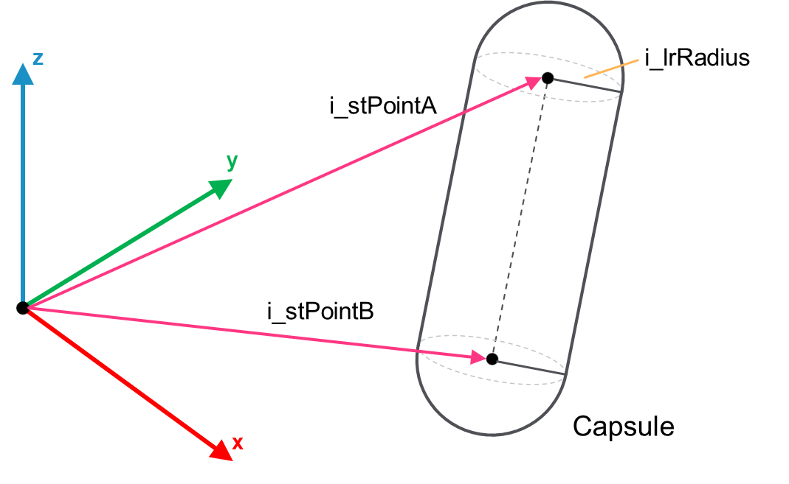

# IF\_Capsule – SetPointsRadius (Method)

## Overview

|  |  |
| --- | --- |
| Type: | Method |
| Available as of: | V1.0.0.0 |

This chapter provides information on:

* [Task](#SetPointsRadiusMethod-A28CC2BA__Task-A307AA39)
* [Description](#SetPointsRadiusMethod-A28CC2BA__Description-A28D17B0)
* [Interface](#SetPointsRadiusMethod-A28CC2BA__Interface-A28DFA6D)

## Task

This method initializes the Capsule object using two points and a radius.

## Description

The method can be called multiple times to reconfigure the object.

The following figure represents i\_stPointA, i\_stPointB and i\_lrRadiusparameters of a Capsule object:

## Interface

Access: PUBLIC

| Input | Data type | Description |
| --- | --- | --- |
| i\_stPointA | SE\_Math.ST\_Vector3D | Point A Capsule object. |
| i\_stPointB | SE\_Math.ST\_Vector3D | Point B Capsule object. |
| i\_lrRadius | LREAL | Radius of the Capsule object. |

| Output | Data type | Description |
| --- | --- | --- |
| q\_xError | BOOL | The output is set to TRUE if an error has been detected during the execution. |
| q\_etResult | [ET\_Result](ET_ResultEnumerator-9BCEF714.html#ET_ResultEnumerator-9BCEF714) | POU-specific output on the diagnostic; q\_xError = FALSE -> Status message; q\_xError = TRUE -> Diagnostic message. |
| q\_sResultMsg | STRING(80) | Event-triggered message that gives additional information on the diagnostic state. |

EIO0000004468.00

© 2021

Schneider Electric.

All rights reserved.