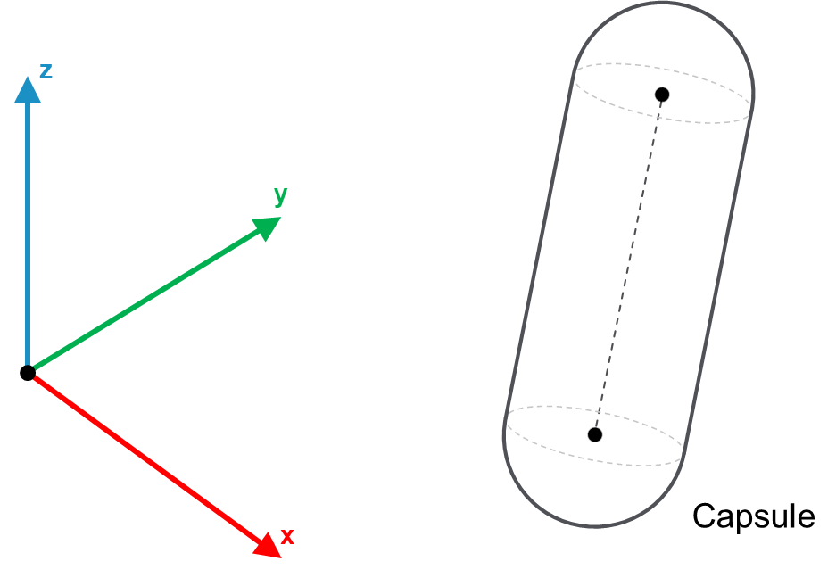

# IF\_Capsule – General Information

## Overview

|  |  |
| --- | --- |
| Type: | Interface |
| Available as of: | V1.0.0.0 |
| Inherits from: | - |

This chapter provides information on:

* [Task](#IF_CapsuleGeneralInformation-A28A58E3__Task-A28B503B)
* [Description](#IF_CapsuleGeneralInformation-A28A58E3__Description-A28B54ED)
* Method [SetPointsRadius](SetPointsRadiusMethod-A28CC2BA.html)
* [Properties](#IF_CapsuleGeneralInformation-A28A58E3__Properties-A28BEB3B)

## Task

Interface for a Capsule collision object.

## Description

Interface for a Capsule collision object. A Capsule is defined by two points, A and B, and a radius.

The following graphic represents a Capsule object:

## Properties

| Name | Data type | Accessing | Description |
| --- | --- | --- | --- |
| rstPointA | REFERENCE TO SE\_Math.ST\_Vector3D | Get | The point A defining the Capsule object. |
| rstPointB | REFERENCE TO SE\_Math.ST\_Vector3D | Get | The point B defining the Capsule object. |
| lrRadius | LREAL | Get | Radius of the Capsule object. |
| etType | [ET\_CollisionObjectType](ET_CollisionObjectTypeEnumerator-9BDA75F7.html#ET_CollisionObjectTypeEnumerator-9BDA75F7) | Get | This property describes the type of bounding volume implemented by the object. |
| xConfigured | BOOL | Get | The value of this property is TRUE if the object has been properly initialized, FALSE otherwise. |

EIO0000004468.00

© 2021

Schneider Electric.

All rights reserved.