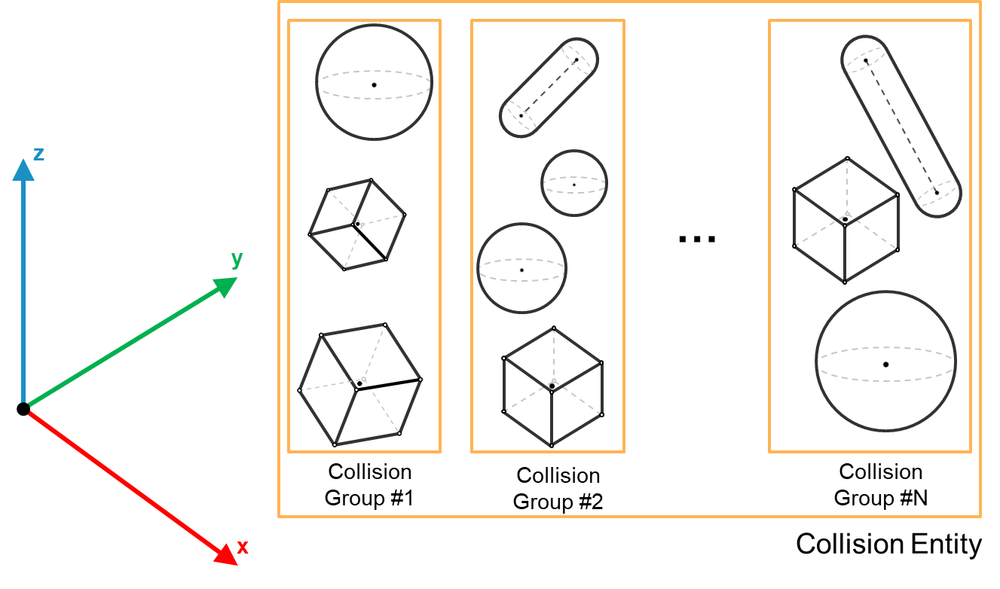

# IF\_CollisionEntity – General Information

## Overview

|  |  |
| --- | --- |
| Type: | Interface |
| Available as of: | V1.0.0.0 |
| Inherits from: | - |

This chapter provides information on:

* [Task](#IF_CollisionEntityGeneralInformatio-A2F9354A__Task-A2F9A141)
* [Description](#IF_CollisionEntityGeneralInformatio-A2F9354A__Description-A2F9E18A)
* Methods:

  + [Update](IF_CollisionEntityUpdateMethod-A30B25C1.html)
  + [Reset](IF_CollisionEntityResetMethod-A30EE44B.html)
* [Properties](#IF_CollisionEntityGeneralInformatio-A2F9354A__Properties-A2FB2F8E)

## Task

Interface for a collision entity.

## Description

* A collision entity can contain one or more groups of collision objects and can be used to represent complex machine parts from the collision point of view.
* A collision entity can be used as input for the collision and distance query functions.

Extension: IF\_CollisionQueryInterface

The following graphic represents the structure of a collision entity:

## Properties

| Name | Data type | Accessing | Description |
| --- | --- | --- | --- |
| raifCollisionGroups | REFERENCE TO ARRAY [1...Gc\_udiMaxNumberOfCollisionEntityGroups OF IF\_CollisionGroup | Get | This property contains a list of collision groups interfaces added to the entity. |
| raxEnableCollisionGroups | REFERENCE TO ARRAY [1...Gc\_udiMaxNumberOfCollisionEntityGroups] OF BOOL | Get, Set | Allows to selectively enable/disable the groups added to the entity. A group which enables flag has been set to FALSE is not considered by any collision or distance queries that include this entity.  The groups are enabled by default. |
| udiNumberOfCollisionGroups | UDINT | Get | The number of collision groups added to the entity. |
| xUpdated | BOOL | Get | The property is set to TRUE if the latest call of the Update method was successful, FALSE otherwise. NOTE: The property needs to have a TRUE value before performing a collision or distance query involving the group. |

EIO0000004468.00

© 2021

Schneider Electric.

All rights reserved.