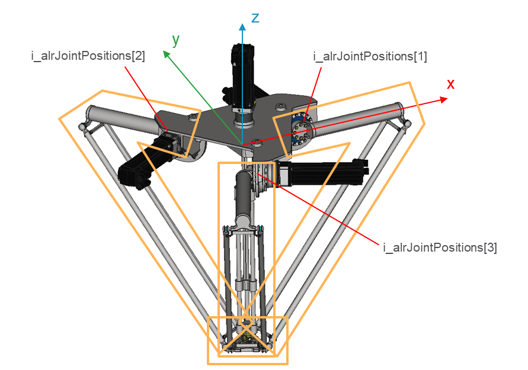

# IF\_CollisionHandlerDelta3Ax - UpdateFromJointPositions (Method)

## Overview

|  |  |
| --- | --- |
| Type: | Method |
| Available as of: | V1.0.0.0 |

This chapter provides information on:

* [Task](#IF_CollisionHandlerDelta3Ax-UpdateF-C48FF362__Task-B68D8D15)
* [Description](#IF_CollisionHandlerDelta3Ax-UpdateF-C48FF362__Description-B68D8F46)
* [Interface](#IF_CollisionHandlerDelta3Ax-UpdateF-C48FF362__Interface-B68D922B)

## Task

Update the position and orientation of each default collision object

## Description

Update the position and orientation of each default collision object based on the joint positions provided as input. The default collision objects are those that are automatically created and configured inside the collision entity of the collision handler.

NOTE: This method does not affect the position and orientation of the collision objects inside the collision groups that have been added by you. When calling this method, the collision objects that are part of the groups must have xConfigured = TRUE, so that the groups can be successfully updated.

## Interface

Access: PUBLIC

| Input | Data type | Description |
| --- | --- | --- |
| i\_alrJointPositions | ARRAY [1...Gc\_udiDelta3AxNumberOfJoints] OF LREAL | Joint positions of a Delta3Ax robot. |

| Output | Data type | Description |
| --- | --- | --- |
| q\_xError | BOOL | The output is set to TRUE if an error has been detected during the execution. |
| q\_etResult | [ET\_Result](ET_ResultEnumerator-9BCEF714.html#ET_ResultEnumerator-9BCEF714) | POU-specific output on the diagnostic; q\_xError = FALSE -> Status message; q\_xError = TRUE -> Diagnostic message. |
| q\_sResultMsg | STRING(80) | Event-triggered message that gives additional information on the diagnostic state. |

EIO0000004468.00

© 2021

Schneider Electric.

All rights reserved.