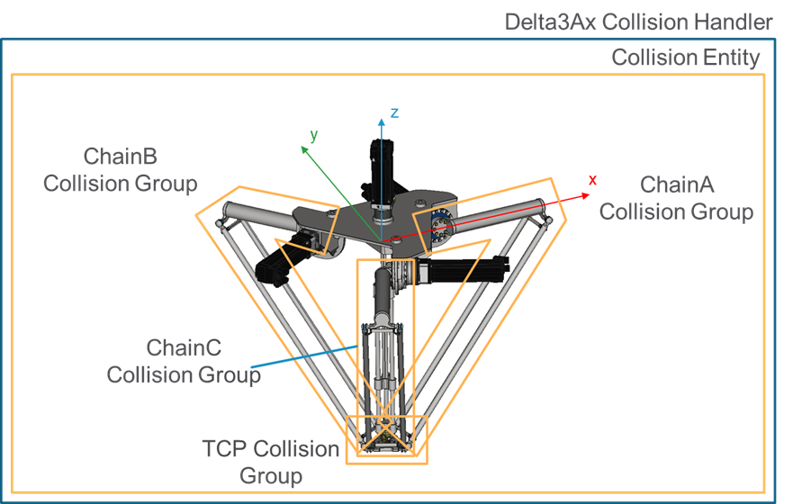
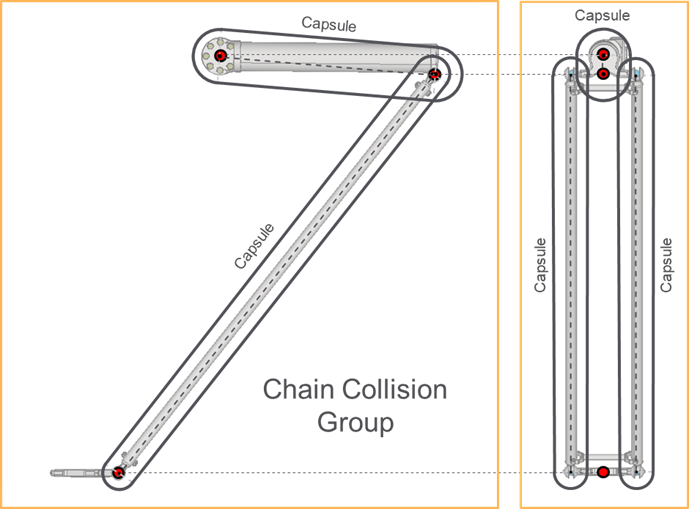

# IF\_CollisionHandlerDelta3Ax - General Information

## Overview

|  |  |
| --- | --- |
| Type: | Interface |
| Available as of: | V1.0.0.0 |
| Inherits from: | - |

This chapter provides information on:

* [Task](#IF_Collisio-AF6D93FB__Task-A492443F)
* [Description](#IF_Collisio-AF6D93FB__Description-A492433E)
* [Properties](#IF_Collisio-AF6D93FB__Properties-A494F95F)
* Methods:

  + [EvaluateDirectKinematics](IF_Collision-AF6D7F3C.html#IF_Collision-AF6D7F3C)
  + [UpdateFromKinematicsResult](IF_CollisionHandlerDelta3AxUpdateFr-C4984235.html#IF_CollisionHandlerDelta3AxUpdateFr-C4984235)
  + [UpdateFromJointPositions](IF_CollisionHandlerDelta3Ax-UpdateF-C48FF362.html#IF_CollisionHandlerDelta3Ax-UpdateF-C48FF362)
  + [SetParameters](IF_CollisionHandlerDelta3Ax-SetPara-C49020AF.html#IF_CollisionHandlerDelta3Ax-SetPara-C49020AF)
  + [EvaluateInverseKinematics](IF_CollisionHandlerDelta3Ax-Evaluat-B8ABE79E.html#IF_CollisionHandlerDelta3Ax-Evaluat-B8ABE79E)
  + [GetParameters](IF_CollisionHandlerDelta3Ax-GetPara-C49871F0.html#IF_CollisionHandlerDelta3Ax-GetPara-C49871F0)

## Task

Interface for collision handler of a Delta3Ax robot.

## Description

This interface contains methods and properties related to the configuration and update of the collision handler of a Delta3Ax robot.

Extension: \_\_System.IQueryInterface

The following graphic presents the collision entity configuration for aDelta3Ax collision handler:

The collision entity of a Delta3Ax collision handler is configured with:

* A capsule for each upper link, with point A configured as the Joint1 position and the point B evaluated along the Joint1-Joint2 direction at a position determined by the configured length of the link.
* A capsule for each lower link, with point A configured as the Joint2 position plus/minus lrLowerLinksMountDistance along the Y-axis of the link frame and the point B evaluated along the direction from Joint2 to Joint3, at a position determined by the configured length of the link.
* An OBB with extents determined by the configured values of stTCPBoxHalfExtents and center evaluated as the TCP position combined with the configured stTCPBoxPosition that is defined with reference to the TCP frame.

For more information on the parameters, refer to [ST\_Delta3AxParameters](ST_Delta3AxParameters-GeneralInform-9BE41F8B.html#ST_Delta3AxParameters-GeneralInform-9BE41F8B)

The following graphic shows a chain group of the collision entity of a Delta3Ax collision handler:

## Properties

| Name | Data type | Accessing | Description |
| --- | --- | --- | --- |
| xEnableTCPCollisionGroup | BOOL | Get, Set | If TRUE, the collision group representing the TCP is enabled; if FALSE, the collision group is disabled.  NOTE: A disabled collision group is ignored by the collision and distance queries. |
| raxEnableChainCollisionGroup | REFERENCE TO ARRAY [1...Gc\_udiDelta3AxNumberOfJoints] OF BOOL | Get, Set | Each element of this property allows to enable (TRUE value) or disable (FALSE value) a collision group linked to one of the chains of the robot. It is possible to use the elements of ET\_Delta3AxCollisionGroupIndex to index the desired collision group.  NOTE: A disabled collision group is ignored by the collision and distance queries. |

EIO0000004468.00

© 2021

Schneider Electric.

All rights reserved.