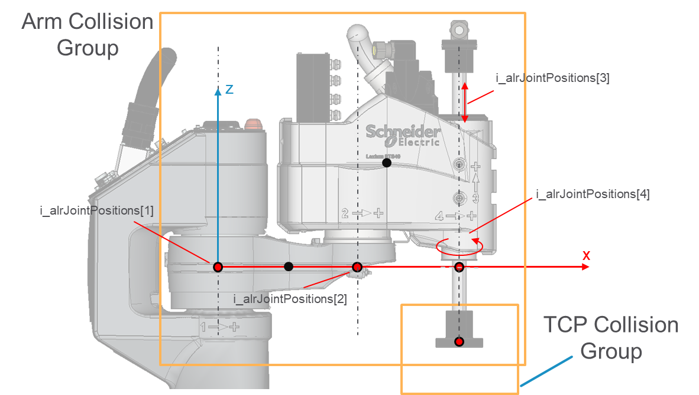

# IF\_CollisionHandlerSCARA4Ax - EvaluateDirectKinematics (Method)

## Overview

|  |  |
| --- | --- |
| Type: | Method |
| Available as of: | V1.0.0.0 |

This chapter provides information on:

* [Task](#IF_CollisionHandlerSCARA4Ax-Evaluat-B8ACED24__Task-B82FED05)
* [Description](#IF_CollisionHandlerSCARA4Ax-Evaluat-B8ACED24__Description-B82FEEE5)
* [Interface](#IF_CollisionHandlerSCARA4Ax-Evaluat-B8ACED24__Interface-B82FF226)

## Task

Evaluates the solution of the direct kinematics.

## Description

Starting from the joint positions, this method evaluates the solution of the direct kinematics, returning the Cartesian position of the intermediate points in the kinematic structure.

The following graphic shows the elements of i\_alrJointPositions:

## Interface

Access: PUBLIC

| Input | Data type | Description |
| --- | --- | --- |
| i\_alrJointPositions | ARRAY [1...Gc\_udiSCARA4AxNumberOfJoints] OF LREAL | Joint positions of aSCARA4Ax robot. |

| Output | Data type | Description |
| --- | --- | --- |
| q\_xError | BOOL | The output is set to TRUE if an error has been detected during the execution. |
| q\_etResult | [ET\_Result](ET_ResultEnumerator-9BCEF714.html#ET_ResultEnumerator-9BCEF714) | POU-specific output on the diagnostic; q\_xError = FALSE -> Status message; q\_xError = TRUE -> Diagnostic message. |
| q\_sResultMsg | STRING(80) | Event-triggered message that gives additional information on the diagnostic state. |
| q\_stResultLocal | [ST\_SCARA4AxKinematicsResult](ST_SCARA4AxKinematicsResultGeneralI-9F7919B3.html#ST_SCARA4AxKinematicsResultGeneralI-9F7919B3) | Result of the kinematics, referred to the local coordinate system of the robot.  This result can be provided as input of UpdateFromKinematicsResult. |
| q\_stResultGlobal | [ST\_SCARA4AxKinematicsResult](ST_SCARA4AxKinematicsResultGeneralI-9F7919B3.html#ST_SCARA4AxKinematicsResultGeneralI-9F7919B3) | Result of the kinematics, referred to a global coordinate system. This is evaluated based on the configured values of base position and orientation. |

EIO0000004468.00

© 2021

Schneider Electric.

All rights reserved.