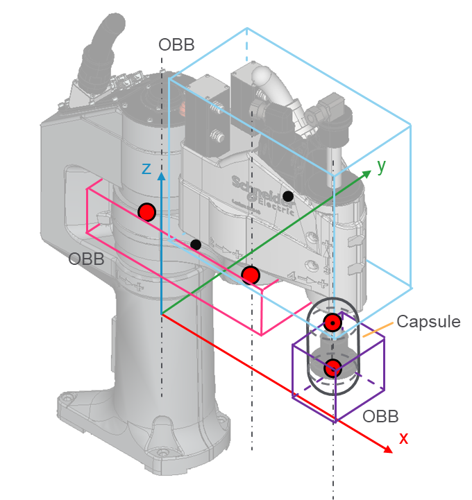

# IF\_CollisionHandlerSCARA4Ax - General Information

## Overview

|  |  |
| --- | --- |
| Type: | Interface |
| Available as of: | V1.0.0.0 |
| Inherits from: | - |

This chapter provides information on:

* [Task](#IF_CollisionHandlerSCARA4Ax-General-B8AC2628__Task-B82D247A)
* [Description](#IF_CollisionHandlerSCARA4Ax-General-B8AC2628__Description-B82D25E9)
* [Properties](#IF_CollisionHandlerSCARA4Ax-General-B8AC2628__Properties-B82D28E7)
* Methods:

  + [EvaluateDirectKinematics](IF_CollisionHandlerSCARA4Ax-Evaluat-B8ACED24.html)
  + [UpdateFromKinematicsResult](IF_CollisionHandlerSCARA4Ax-UpdateF-C49732B0.html)
  + [UpdateFromJointPositions](IF_CollisionHandlerSCARA4Ax-UpdateF-C49083DF.html)
  + [SetParameters](IF_CollisionHandlerSCARA4Ax-SetPara-C48FCB60.html)
  + [EvaluateInverseKinematics](IF_CollisionHandlerSCARA4Ax-Evaluat-C48979CA.html)
  + [GetParameters](IF_CollisionHandlerSCARA4Ax-GetPara-C48EFFF8.html)

## Task

Interface for collision handler of a SCARA4Ax robot.

## Description

This interface contains methods and properties related to the configuration and update of the collision handler of a SCARA4Ax robot.

Extension: \_\_System.IQueryInterface

The following graphic shows a collision entity configuration for a SCARA4Ax collision handler:

The collision entity of a SCARA4Ax collision handler is configured with:

* An OBB (Oriented Bounding Box) representing the arm link with center at the middle point between the origin and the arm position, orientation given by the arm frame and size determined by the configured length, width and height of the arm; the position of the center can be affected by the vector stArmMountPositionOffset
* An OBB representing the arm link with center at the middle point between the arm and the forearm position, orientation given by the forearm frame and size determined by the configured length, width and height of the forearm; the position of the center can be affected by the vector stForearmMountPositionOffset
* A capsule with top point at the forearm position plus the configured value of lrEndEffectorStartZOffset on its Z-coordinate and bottom point at the TCP position; the radius of the capsule depends on the value of lrEndEffectorRadius
* An OBB with extents determined by the configured values of stTCPBoxHalfExtents and center evaluated as the TCP position combined with the configured stTCPBoxPosition that is defined with reference to the TCP frame

For more information, refer to [ST\_SCARA4AxParameters](ST_SCARA4AxParametersGeneralInforma-9F6A25C0.html#ST_SCARA4AxParametersGeneralInforma-9F6A25C0).

## Properties

| Name | Data type | Accessing | Description |
| --- | --- | --- | --- |
| xEnableArmCollision | BOOL | Get, Set | This property allows to enable (TRUE value) or disable (FALSE value) the collision group linked to the arm of the robot. It is possible to use the elements of ET\_SCARA4AxCollisionGroupIndex to index the desired collision group.  NOTE: A disabled collision group is ignored by the collision and distance queries. |
| xEnableTCPCollisionGroup | BOOL | Get, Set | If TRUE, the collision group representing the TCP is enabled; if FALSE, the collision group is disabled.  NOTE: A disabled collision group is ignored by the collision and distance queries. |

EIO0000004468.00

© 2021

Schneider Electric.

All rights reserved.