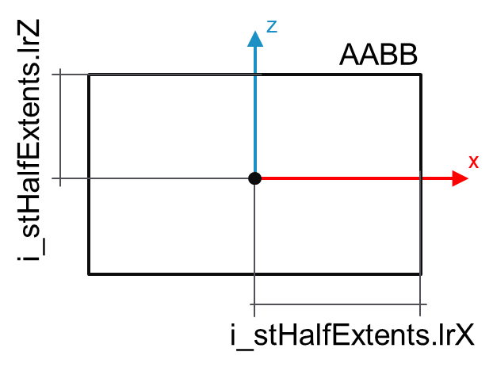

# FB\_AABB – SetCenterHalfExtents (Method)

## Overview

|  |  |
| --- | --- |
| Type: | Method |
| Available as of: | V1.0.0.0 |

This chapter provides information on:

* [Task](#FB_AABBSetCenterHalfExtentsMethod-B8B7A0B0__Task-B8B7DE10)
* [Description](#FB_AABBSetCenterHalfExtentsMethod-B8B7A0B0__Description-B8B7DFEB)
* [Interface](#FB_AABBSetCenterHalfExtentsMethod-B8B7A0B0__Interface-B8B7E24E)
* [Diagnostic messages](#FB_AABBSetCenterHalfExtentsMethod-B8B7A0B0__DiagnosticMessages-B8B8A6E2)

## Task

Sets the center and half extents.

## Description

This method is used to initialize an AABB object by setting its minimum and maximum vertices. The full list of vertices, the center and the half extents of the AABB are evaluated accordingly.

i\_stHalfExtents parameters (XZ plane view):

i\_stHalfExtents parameters (XY-plane view):

## Interface

The function block implements the interface [IF\_AABB](SetCenterHalfExtentsMethod-A1069122.html#SetCenterHalfExtentsMethod-A1069122__Interface-A108B90E).

Access: PUBLIC

| Input | Data type | Description |
| --- | --- | --- |
| i\_stCenter | SE\_Math.ST\_Vector3D | The center of the AABB bounding volume. |
| i\_stHalfExtents | SE\_Math.ST\_Vector3D | Each element of this 3D vector represents the half extents of the AABB object along the X-, Y- anx Z-axes. |

| Output | Data type | Description |
| --- | --- | --- |
| q\_xError | BOOL | The output is set to TRUE if an error has been detected during the execution. |
| q\_etResult | [ET\_Result](ET_ResultEnumerator-9BCEF714.html#ET_ResultEnumerator-9BCEF714) | POU-specific output on the diagnostic; q\_xError = FALSE -> Status message; q\_xError = TRUE -> Diagnostic message. |
| q\_sResultMsg | STRING(80) | Event-triggered message that gives additional information on the diagnostic state. |

## Diagnostic Messages

| q\_xError | q\_etResult | Enumeration value | Description |
| --- | --- | --- | --- |
| FALSE | [OK](#FB_AABBSetCenterHalfExtentsMethod-B8B7A0B0__OK-BA3AF847) | 0 | Success |
| TRUE | [HalfExtentsRange](#FB_AABBSetCenterHalfExtentsMethod-B8B7A0B0__HalfExtentsRange-C4F8BE7B) | 3 | The provided value for the half extents is outside the admissible range. |

## OK

|  |  |
| --- | --- |
| Enumeration name: | Ok |
| Enumeration value: | 0 |
| Description: | Success |

## HalfExtentsRange

|  |  |
| --- | --- |
| Enumeration name: | HalfExtentsRange |
| Enumeration value: | 3 |
| Description: | The provided value for the half extents is outside the admissible range. |

| Issue | Cause | Solution |
| --- | --- | --- |
| Could not set center and half extents. | At least one of the values of i\_stHalfExtents is either negative or null. | Make sure that:   * i\_stHalfExtents.lrX > 0.0 * i\_stHalfExtents.lrY > 0.0 * i\_stHalfExtents.lrZ > 0.0 |

EIO0000004468.00

© 2021

Schneider Electric.

All rights reserved.