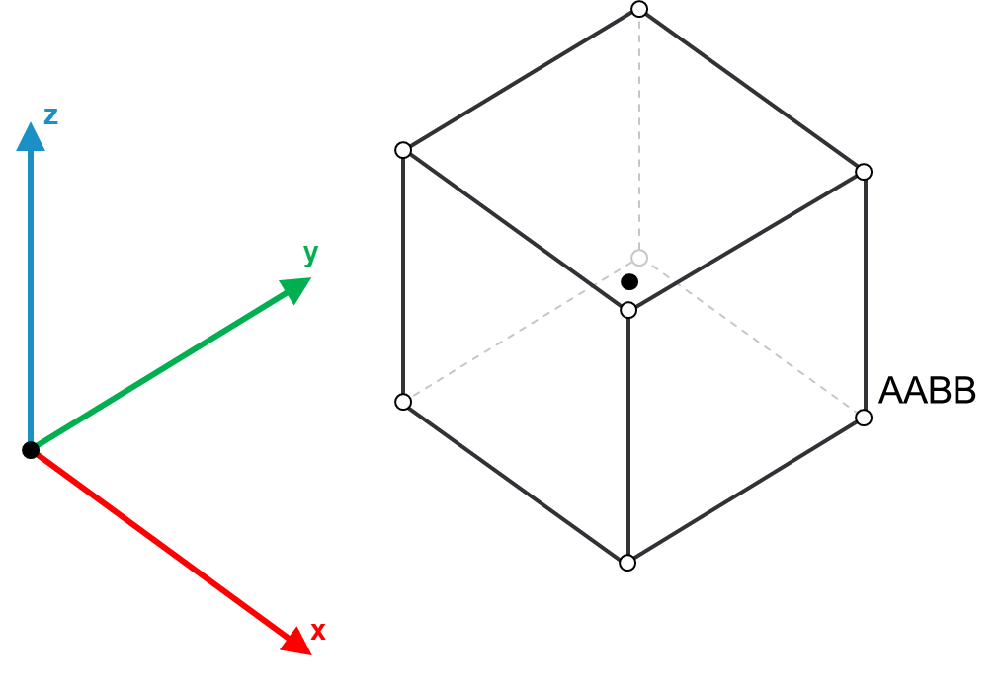

# FB\_AABB - SetMinMaxVertices (Method)

## Overview

|  |  |
| --- | --- |
| Type: | Method |
| Available as of: | V1.0.0.0 |

This chapter provides information on:

* [Task](#FB_AABBSetMinMaxVerticesMethod-B92AA7D5__Task-C49A75D4)
* [Description](#FB_AABBSetMinMaxVerticesMethod-B92AA7D5__Description-A0FD5512)
* [Interface](#FB_AABBSetMinMaxVerticesMethod-B92AA7D5__Interface-C498C204)
* [Diagnostic Messages](#FB_AABBSetMinMaxVerticesMethod-B92AA7D5__DiagnosticMessages-BBDD34E9)

## Task

Sets the minimum and maximum vertices.

## Description

This method is used to initialize an AABB object by setting its minimum and maximum vertices; the full list of vertices, the center and the half extents of the AABB are evaluated accordingly.

The following figure is a representation of an Axis-Aligned Bounding Box (AABB):

## Interface

The function block implements the interface [IF\_AABB](SetMinMaxVerticesMethod-A0FC7A02.html#SetMinMaxVerticesMethod-A0FC7A02__Interface-A0FD969B).

Access: PUBLIC

| Input | Data type | Description |
| --- | --- | --- |
| i\_stMinVertex | SE\_Math.ST\_Vector3D | The minimum vertex among the vertices of the AABB object. |
| i\_stMaxVertex | SE\_Math.ST\_Vector3D | The maximum vertex among the vertices of the AABB object. |

| Output | Data type | Description |
| --- | --- | --- |
| q\_xError | BOOL | The output is set to TRUE if an error has been detected during the execution. |
| q\_etResult | [ET\_Result](ET_ResultEnumerator-9BCEF714.html#ET_ResultEnumerator-9BCEF714) | POU-specific output on the diagnostic; q\_xError = FALSE -> Status message; q\_xError = TRUE -> Diagnostic message. |
| q\_sResultMsg | STRING(80) | Event-triggered message that gives additional information on the diagnostic state. |

## Diagnostic Messages

| q\_xError | q\_etResult | Enumeration value | Description |
| --- | --- | --- | --- |
| FALSE | [OK](#FB_AABBSetMinMaxVerticesMethod-B92AA7D5__OK-C4F7BADE) | 0 | Success |
| TRUE | [MinMaxVerticesInvalid](#FB_AABBSetMinMaxVerticesMethod-B92AA7D5__HalfExtentsRange-BBE01E47) | 4 | The provided set of minimum/maximum values are invalid. |

## OK

|  |  |
| --- | --- |
| Enumeration name: | Ok |
| Enumeration value: | 0 |
| Description: | Success |

## MinMaxVerticesInvalid

|  |  |
| --- | --- |
| Enumeration name: | MinMaxVerticesInvalid |
| Enumeration value: | 4 |
| Description: | The provided set of minimum/maximum values are invalid. |

| Issue | Cause | Solution |
| --- | --- | --- |
| Could not set the minimum and maximum vertices. | One of the following conditions has been verified:   * i\_stMinVertex.lrX  ≥i\_stMaxVertex.lrX * i\_stMinVertex.lrY  ≥i\_stMaxVertex.lrY * i\_stMinVertex.lrZ  ≥i\_stMaxVertex.lrZ | Make sure that:   * i\_stMinVertex.lrX < i\_stMaxVertex.lrX * i\_stMinVertex.lrY < i\_stMaxVertex.lrY * i\_stMinVertex.lrZ < i\_stMaxVertex.lrZ |

EIO0000004468.00

© 2021

Schneider Electric.

All rights reserved.