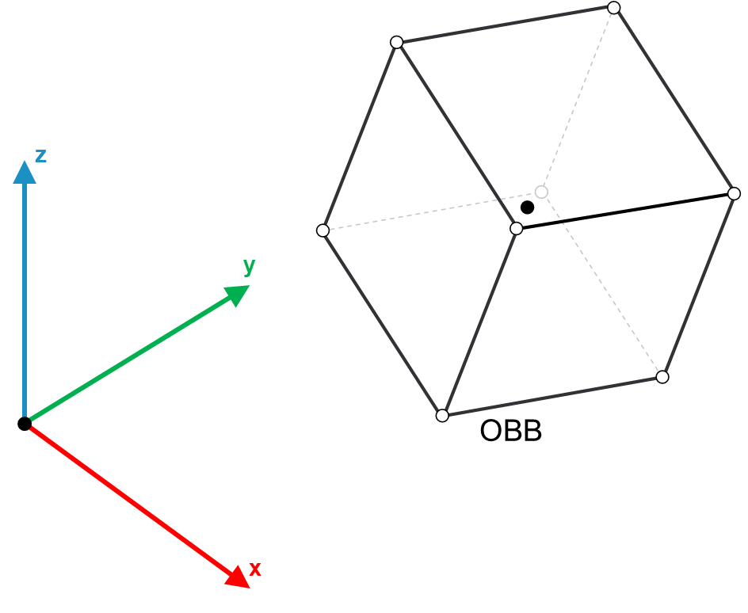

# FB\_OBB - General Information

## Overview

|  |  |
| --- | --- |
| Type: | Function block |
| Available as of: | V1.0.0.0 |
| Inherits from: | - |
| Implements: | IF\_OBB |
| Extends: | FB\_CollisionObject |
| Versions: | Current version |

This chapter provides information on:

* [Task](SetCenterHalfExtentsOrientationMeth-A27D15E9.html)
* [Description](#FB_OBBGeneralInformation-B934AFA9__Description-B934C50C)
* [Properties](#FB_OBBGeneralInformation-B934AFA9__Properties-BC45FE7F)
* Method : [SetCenterHalfExtentsOrientation](IF_OBBSetCenterHalfExtentsOrientati-B93629B8.html#IF_OBBSetCenterHalfExtentsOrientati-B93629B8)

## Task

Sets the center, half extents and orientation of the OBB (Oriented Bounding Box).

## Description

An OBB is a box that is defined by the position of its center, its half extents and its orientation.

The following figure is a representation of an OBB:

## Properties

| Name | Data type | Accessing | Description |
| --- | --- | --- | --- |
| rastVertices | REFERENCE TO ARRAY [1...Gc\_udiMaxNumberOfCollisionObjectVertices] OF SE\_Math.ST\_Vector3D | Get | List of vertices for the OBB object. |
| rstCenter | REFERENCE TO SE\_Math.ST\_Vector3D | Get | Center of the OBB object. |
| rstHalfExtents | REFERENCE TO SE\_Math.ST\_Vector3D | Get | Half extents of the OBB object along X, Y and Z. |
| udiNumberOfVertices | UDINT | Get | Number of vertices of an OBB object. |
| rstOrientation | REFERENCE TO SE\_Math.ST\_Matrix3D | Get | Orientation of the OBB object represented as rotation matrix. |
| etType | ET\_CollisionObjectType | Get | This property describes the type of bounding volume implemented by the object. |
| xConfigured | BOOL | Get | The value of this property is TRUE if the object has been properly initialized, FALSE otherwise. |

EIO0000004468.00

© 2021

Schneider Electric.

All rights reserved.