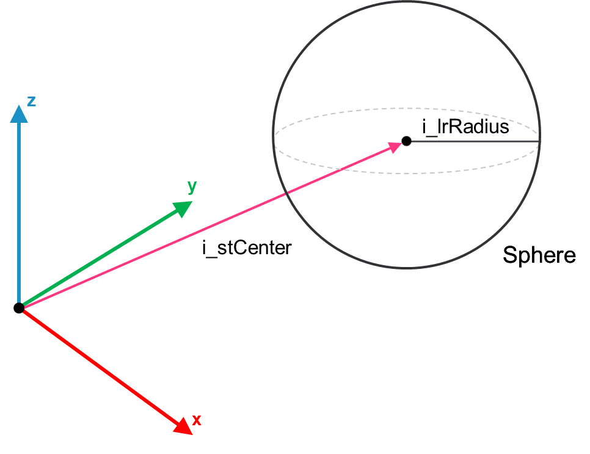

# FB\_Sphere – SetCenterRadius (Method)

## Overview

|  |  |
| --- | --- |
| Type: | Method |
| Available as of: | V1.0.0.0 |

This chapter provides information on:

* [Task](#FB_SphereSetCenterRadiusMethod-C49A1923__Task-BC485B69)
* [Description](#FB_SphereSetCenterRadiusMethod-C49A1923__Description-BC485D74)
* [Interface](#FB_SphereSetCenterRadiusMethod-C49A1923__Interface-BC48609F)
* [Diagnostic Messages](#FB_SphereSetCenterRadiusMethod-C49A1923__DiagnosticMessages-BC491E26)

## Task

Set the center and the radius of the Sphere collision object.

## Description

This method can be called multiple times to reconfigure the object.

The following figure represents i\_stCenter and i\_lrRadius parameters of a Sphere object:

## Interface

The function block implements the interface [IF\_Sphere](SetCenterRadiusGeneralInformation-A2886B35.html#SetCenterRadiusGeneralInformation-A2886B35__Interface-A2890DB1).

Access: PUBLIC

| Input | Data type | Description |
| --- | --- | --- |
| i\_stCenter | SE\_Math.ST\_Vector3D | The center of the Sphere object. |
| i\_lrRadius | LREAL | Radius of the Sphere object. |

| Output | Data type | Description |
| --- | --- | --- |
| q\_xError | BOOL | The output is set to TRUE if an error has been detected during the execution. |
| q\_etResult | [ET\_Result](ET_ResultEnumerator-9BCEF714.html#ET_ResultEnumerator-9BCEF714) | POU-specific output on the diagnostic; q\_xError = FALSE -> Status message; q\_xError = TRUE -> Diagnostic message. |
| q\_sResultMsg | STRING(80) | Event-triggered message that gives additional information on the diagnostic state. |

## Diagnostic Messages

| q\_xError | q\_etResult | Enumeration value | Description |
| --- | --- | --- | --- |
| FALSE | [OK](#FB_SphereSetCenterRadiusMethod-C49A1923__OK-BC4ABD3E) | 0 | Success |
| TRUE | [RadiusRange](#FB_SphereSetCenterRadiusMethod-C49A1923__RadiusRange-BC4ACCD4) | 5 | The provided value for the radius is outside the admissible range. |

## OK

|  |  |
| --- | --- |
| Enumeration name: | Ok |
| Enumeration value: | 0 |
| Description: | Success |

## RadiusRange

|  |  |
| --- | --- |
| Enumeration name: | RadiusRange |
| Enumeration value: | 5 |
| Description: | The provided value for the radius is outside the admissible range. |

| Issue | Cause | Solution |
| --- | --- | --- |
| Could not set center and radius. | The provided radius i\_lrRadius has a negative or zero value. | Verify that i\_lrRadius > 0.0. |

EIO0000004468.00

© 2021

Schneider Electric.

All rights reserved.