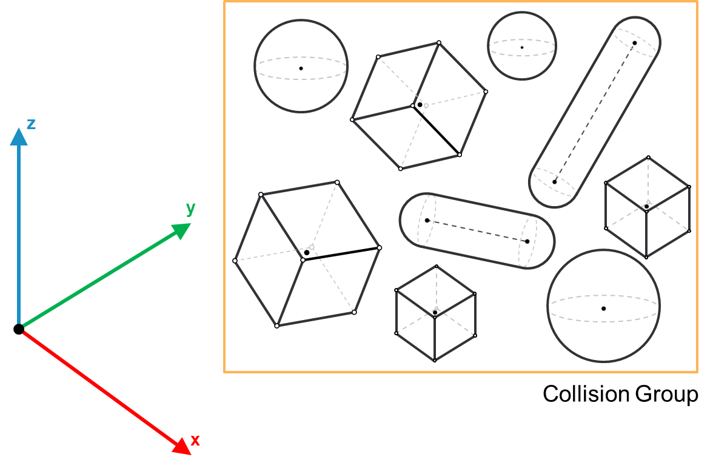

# FB\_CollisionGroup – General Information

## Overview

|  |  |
| --- | --- |
| Type: | Function block |
| Available as of: | V1.0.0.0 |
| Inherits from: | - |
| Implements: | IF\_CollisionGroup |
| Versions: | Current version |

This chapter provides information on:

* [Task](#FB_CollisionGroupGeneralInformation-BC5A074C__Task-BC5A0FF7)
* [Description](#FB_CollisionGroupGeneralInformation-BC5A074C__Description-BC5A1174)
* [Properties](#FB_CollisionGroupGeneralInformation-BC5A074C__Properties-BC5A13C3)
* Methods:

  + [AddCollisionObject](FB_CollisionGroupAddCollisionObject-BC5BEB42.html#FB_CollisionGroupAddCollisionObject-BC5BEB42)
  + [Update](FB_CollisionGroupUpdateMethod-C49A9C71.html#FB_CollisionGroupUpdateMethod-C49A9C71)
  + [Reset](FB_CollisionGroupResetMethod-BCC23187.html#FB_CollisionGroupResetMethod-BCC23187)

## Task

Implementation of a collision group.

## Description

* A collision group is an object grouping one or more collision objects.
* This function block has been implemented to minimize the number of queries in case of a collision query involving a group of objects.
* The objects within a group can overlap, since the library does not query for collisions between objects in the same group.
* A collision group can be used as an input for the collision and distance query functions.

The following graphic shows different collision objects being part of the same collision group:

## Properties

| Name | Data type | Accessing | Description |
| --- | --- | --- | --- |
| raifCollisionObjects | REFERENCE TO ARRAY [1...Gc\_udiMaxNumberOfCollisionGroupObjects OF IF\_CollisionObject | Get | Reference to the list of collision objects added to the group |
| udiNumberOfCollisionObjects | UDINT | Get | The number of collision objects added to the group. |
| raxEnableCollisionObjects | REFERENCE TO ARRAY [1...Gc\_udiMaxNumberOfCollisionGroupObjects] OF BOOL | Get, Set | Allows to selectively enable/disable the objects added to the group. An object which enable flag has been set to FALSE will not be considered by any collision or distance queries that include this group.  The objects are enabled by default. |
| xUpdated | BOOL | Get | The property is set to TRUE if the latest call of the [Update](UpdateMethod-A2946F3F.html#UpdateMethod-A2946F3F)  method was successful, FALSE otherwise.  NOTE: The property needs to have a TRUE value before performing a collision or distance query involving the group. |

EIO0000004468.00

© 2021

Schneider Electric.

All rights reserved.