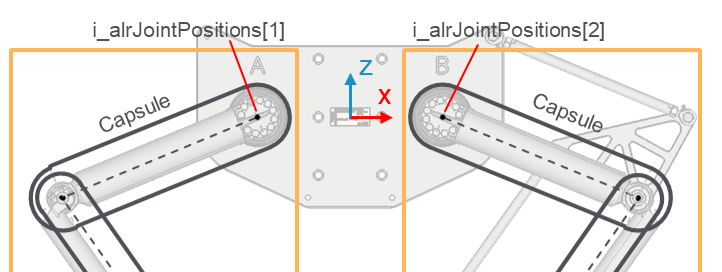

# FB\_CollisionHandlerDelta2Ax – EvaluateDirectKinematics (Method)

## Overview

|  |  |
| --- | --- |
| Type: | Method |
| Available as of: | V1.0.0.0 |

This chapter provides information on:

* [Task](#FB_CollisionHandlerDelta2AxEvaluate-BCE4D633__Task-BCE504E1)
* [Description](#FB_CollisionHandlerDelta2AxEvaluate-BCE4D633__Description-BCE506FA)
* [Interface](#FB_CollisionHandlerDelta2AxEvaluate-BCE4D633__Interface-BCE5096B)
* [Diagnostic Messages](#FB_CollisionHandlerDelta2AxEvaluate-BCE4D633__DiagnosticMessages-BCE59CE0)

## Task

Evaluates the solution of the direct kinematics.

## Description

Starting from the joint positions, this method evaluates the solution of the direct kinematics, returning the Cartesian position of the intermediate points in the kinematic structure.

The following graphic shows the elements of i\_alrJointPositions.

## Interface

The function block implements the interface of [IF\_CollisionHandlerDelta2Ax](IF_CollisionHandlerDelta2AxEvaluate-A40A897B.html#IF_CollisionHandlerDelta2AxEvaluate-A40A897B__Interface-A40B450E).

Access: PUBLIC

| Input | Data type | Description |
| --- | --- | --- |
| i\_alrJointPositions | ARRAY [1...Gc\_udiDelta2AxNumberOfJoints] OF LREAL | Joint positions of a Delta2Ax robot. |

| Output | Data type | Description |
| --- | --- | --- |
| q\_xError | BOOL | The output is set to TRUE if an error has been detected during the execution. |
| q\_etResult | [ET\_Result](ET_ResultEnumerator-9BCEF714.html#ET_ResultEnumerator-9BCEF714) | POU-specific output on the diagnostic; q\_xError = FALSE -> Status message; q\_xError = TRUE -> Diagnostic message. |
| q\_sResultMsg | STRING(80) | Event-triggered message that gives additional information on the diagnostic state. |
| q\_stResultLocal | [ST\_Delta2AxKinematicsResult](ST_Delta2AxKinematicsResultGeneralI-9F67CF9D.html#ST_Delta2AxKinematicsResultGeneralI-9F67CF9D) | Result of the kinematics, referred to the local coordinate system of the robot.  This result can be provided as input of UpdateFromKinematicsResult. |
| q\_stResultGlobal | [ST\_Delta2AxKinematicsResult](ST_Delta2AxKinematicsResultGeneralI-9F67CF9D.html#ST_Delta2AxKinematicsResultGeneralI-9F67CF9D) | Result of the kinematics, referred to a global coordinate system. This is evaluated based on the configured values of base position and orientation. |

## Diagnostic Messages

| q\_xError | q\_etResult | Enumeration value | Description |
| --- | --- | --- | --- |
| FALSE | [Ok](#FB_CollisionHandlerDelta2AxEvaluate-BCE4D633__OK-BCE60FDD) | 0 | Success |
| TRUE | [KinematicResultInvalid](#FB_CollisionHandlerDelta2AxEvaluate-BCE4D633__KinematicResultInvalid-BCE6297E) | 46 | The provided kinematic result is invalid. |

## OK

|  |  |
| --- | --- |
| Enumeration name: | Ok |
| Enumeration value: | 0 |
| Description: | Success |

## KinematicResultInvalid

|  |  |
| --- | --- |
| Enumeration name: | KinematicResultInvalid |
| Enumeration value: | 46 |
| Description: | The provided kinematic result is invalid. |

| Issue | Cause | Solution |
| --- | --- | --- |
| Could not evaluate the direct kinematics | i\_alrJointPositions contains an invalid set of joint positions | Make sure to provide a valid set of joint positions. |

EIO0000004468.00

© 2021

Schneider Electric.

All rights reserved.