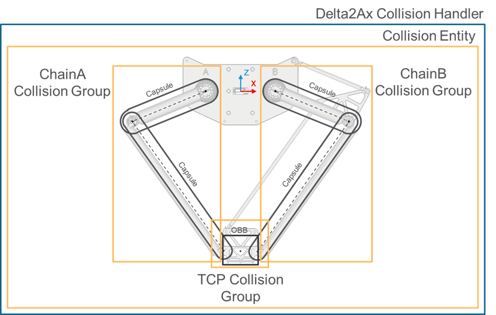

# FB\_CollisionHandlerDelta2Ax - General Information

## Overview

|  |  |
| --- | --- |
| Type: | Function block |
| Available as of: | V1.0.0.0 |
| Inherits from: | - |
| Implements: | IF\_CollisionHandlerDelta2Ax |
| Versions: | Current version |

This chapter provides information on:

* [Task](#FB_CollisionHandlerDelta2AxGeneralI-BCE042CB__Task-BCE0792A)
* [Description](#FB_CollisionHandlerDelta2AxGeneralI-BCE042CB__Description-BCE0756A)
* [Properties](#FB_CollisionHandlerDelta2AxGeneralI-BCE042CB__Properties-BCE28940)
* Methods:

  + [EvaluateDirectKinematics](FB_CollisionHandlerDelta2AxEvaluate-BCE4D633.html#FB_CollisionHandlerDelta2AxEvaluate-BCE4D633)
  + [EvaluateInverseKinematics](FB_CollisionHandlerDelta2AxEvaluate-C48BEA16.html#FB_CollisionHandlerDelta2AxEvaluate-C48BEA16)
  + [UpdateFromJointPositions](FB_CollisionHandlerDelta2AxUpdateFr-BD444464.html)
  + [UpdateFromKinematicsResult](FB_CollisionHandlerDelta2AxUpdateFr-BD47F6C7.html)
  + [SetParameters](FB_CollisionHandlerDelta2AxSetParam-A418377A.html#FB_CollisionHandlerDelta2AxSetParam-A418377A)
  + [GetParameters](FB_CollisionHandlerDelta2AxGetParam-BD524C98.html#FB_CollisionHandlerDelta2AxGetParam-BD524C98)

## Task

Manages the collision handler of a Delta2Ax robot.

## Description

Implements the collision handler of a Delta2Ax robot.

Using this collision handler, starting from a set of parameters it is possible to automatically configure a collision entity representing the structure of a Delta2Ax robot. Then, it is possible to update the collision entity based on the joint positions or the TCP position of the robot.

Extends: FB\_CollisionHandlerRobot

The following graphic presents the collision entity configuration for a Delta2Ax collision handler:

## Properties

| Name | Data type | Accessing | Description |
| --- | --- | --- | --- |
| xEnableTCPCollisionGroup | BOOL | Get, Set | If TRUE, the collision group representing the TCP is enabled; if FALSE, the collision group is disabled.  NOTE: A disabled collision group is ignored by the collision and distance queries. |
| raxEnableChainCollisionGroup | REFERENCE TO ARRAY [1...Gc\_udiDelta2AxNumberOfJoints] OF BOOL | Get, Set | Each element of this property allows to enable (TRUE value) or disable (FALSE value) a collision group linked to one of the chains of the robot. It is possible to use the elements of [ET\_Delta2AxCollisionGroupIndex](ET_Delta2AxCollisionGroupIndex-9BDD1564.html#ET_Delta2AxCollisionGroupIndex-9BDD1564) to index the desired collision group.  NOTE: A disabled collision group is ignored by the collision and distance queries. |
| xUpdated | BOOL | Get | The property is set to TRUE if the latest call of the Update method was successful; FALSE otherwise.  NOTE: This property should have a TRUE value before using the function block with any of the collision or distance query functions. |
| xConfigured | BOOL | Get | TRUE if the function block is configured, FALSE otherwise. |
| ifCollisionEntity | [IF\_CollisionEntity](IF_CollisionEntityGeneralInformatio-A2F9354A.html#IF_CollisionEntityGeneralInformatio-A2F9354A) | Get | Reference to the collision entity configured and updated by the collision handler.  NOTE:  * This interface can be provided as input of the collision and distance queries. * This interface allows to directly access the collision entity managed by the collision handler; any operation on such interface should be avoided before IF\_CollisionHandler.xConfigured = TRUE. |
| rstBasePosition | REFERENCE TO SE\_Math.ST\_Vector3D | Get | Position of the entity with reference to a global coordinate system. |
| etType | [ET\_CollisionHandlerType](ET_CollisionHandlerTypeEnumerator-9BDBFC97.html#ET_CollisionHandlerTypeEnumerator-9BDBFC97) | Get | The type of the collision handler; this is related to the type of represented module. |

EIO0000004468.00

© 2021

Schneider Electric.

All rights reserved.