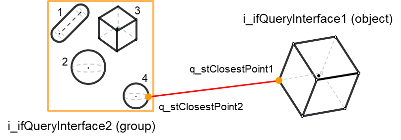
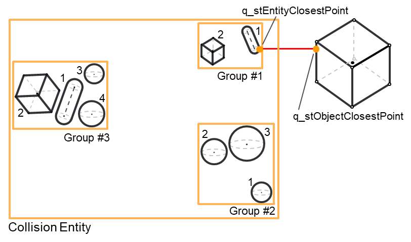
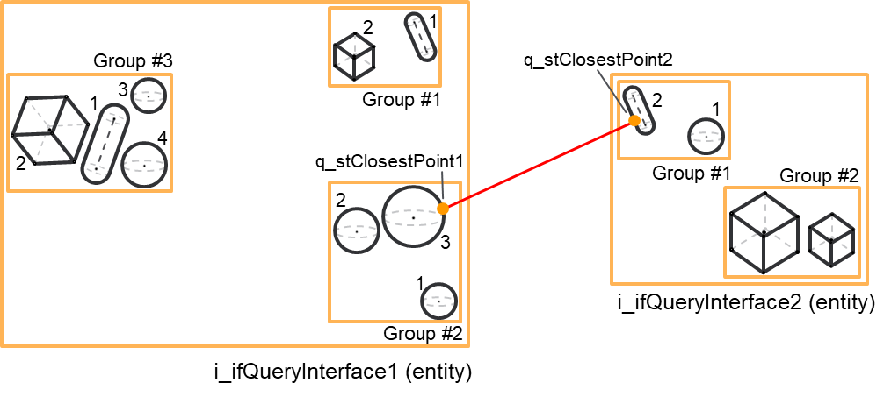

# FC\_DistanceQuery – General Information

## Overview

|  |  |
| --- | --- |
| Type: | Function |
| Available as of: | V1.0.0.0 |
| Versions: | Current version |

This chapter provides information on:

* [Description](#FC_DistanceQueryGeneralInformation-B9BF0FE9__Description-B9BF5B08)
* [Interface](#FC_DistanceQueryGeneralInformation-B9BF0FE9__Interface-B9BF8075)
* [Diagnostic Messages](#FC_DistanceQueryGeneralInformation-B9BF0FE9__DiagnosticMessages-B9C28430)
* [Examples](#FC_DistanceQueryGeneralInformation-B9BF0FE9__Examples-BA2DE5C3)

## Description

This function requires any combination of collision objects, collision groups or collision entities as inputs.

As a result, it returns:

* The minimum distance between the inputs
* If i\_xEvaluateClosestPoints is set to TRUE, the function will evaluate the closest points between the two inputs

## Interface

| Input | Data type | Description |
| --- | --- | --- |
| i\_ifQueryInterface1 | [IF\_CollisionQueryInterface](IF_CollisionQueryInterfaceGeneralIn-9FFDD96D.html#IF_CollisionQueryInterfaceGeneralIn-9FFDD96D) | A first object implementing IF\_CollisionQueryInterface. This can be a collision object, a collision group or a collision entity. |
| i\_ifQueryInterface2 | [IF\_CollisionQueryInterface](IF_CollisionQueryInterfaceGeneralIn-9FFDD96D.html#IF_CollisionQueryInterfaceGeneralIn-9FFDD96D) | A second object implementing IF\_CollisionQueryInterface. This can be a collision object, a collision group or a collision entity. |
| i\_xEvaluateClosestPoints | BOOL | If TRUE, the closest points between the two inputs are evaluated. |

| Output | Data type | Description |
| --- | --- | --- |
| q\_xError | BOOL | The output is set to TRUE if an error has been detected during the execution. |
| q\_etResult | [ET\_Result](ET_ResultEnumerator-9BCEF714.html#ET_ResultEnumerator-9BCEF714) | POU-specific output on the diagnostic; q\_xError = FALSE -> Status message; q\_xError = TRUE -> Diagnostic message. |
| q\_sResultMsg | String | Event-triggered message that gives additional information on the diagnostic state. |
| q\_xCollision | BOOL | TRUE if there is a collision detected between the two inputs. |
| q\_lrDistance | LREAL | The minimum distance between the two inputs. This is zero if q\_xCollision = TRUE. |
| q\_udiCollisionGroupIndex1 | UDINT | Index of the colliding group of i\_ifQueryInterface1.  This has a zero value if i\_ifQueryInterface1 is referring to a collision object or a collision group. |
| q\_udiCollisionObjectIndex1 | UDINT | Index of the closest object in the group with index q\_udiCollisionGroupIndex1 of i\_ifQueryInterface1.  This has a zero value if i\_ifQueryInterface1 is referring to a collision object. |
| q\_udiCollisionGroupIndex2 | UDINT | Index of the closest group of i\_ifQueryInterface2.  This has a zero value if i\_ifQueryInterface2 is referring to a collision object or a collision group. |
| q\_udiCollisionObjectIndex2 | UDINT | Index of the closest object in the group with index q\_udiCollisionGroupIndex2 of i\_ifQueryInterface2. This has a zero value if i\_ifQueryInterface2 is referring to a collision object. |
| q\_stClosestPoint1 | SE\_Math.ST\_Vector3D | Closest point for i\_ifQueryInterface1.  This is only evaluated if i\_xEvaluateClosestPoint = TRUE; otherwise, it will return a null vector. |

## Diagnostic Messages

| q\_xError | q\_etResult | Enumeration value | Description |
| --- | --- | --- | --- |
| FALSE | [OK](#FC_DistanceQueryGeneralInformation-B9BF0FE9__OK-BF51E603) | 0 | Success |
| TRUE | [NoCollisionGroupsEnabled](#FC_DistanceQueryGeneralInformation-B9BF0FE9__NoCollisionGroupsEnabled-BF51E87E) | 36 | No collision groups enabled. |
| TRUE | [InterfaceInvalid](#FC_DistanceQueryGeneralInformation-B9BF0FE9__InterfaceInvalid-BF51ECCD) | 11 | The provided interface is invalid (null). |
| TRUE | [CollisionEntityNotUpdated](#FC_DistanceQueryGeneralInformation-B9BF0FE9__CollisionEntityNotUpdated-BF51EF7F) | 34 | The collision entity has not been updated. |
| TRUE | [CollisionGroupNotUpdated](#FC_DistanceQueryGeneralInformation-B9BF0FE9__CollisionGroupNotUpdated-BF51F340) | 21 | A collision group is not updated. |
| TRUE | [CollisionObjectTypeInvalid](#FC_DistanceQueryGeneralInformation-B9BF0FE9__CollisionObjectTypeInvalid-BF520233) | 16 | The provided collision object type is invalid. |
| TRUE | [CollisionObjectNotConfigured](#FC_DistanceQueryGeneralInformation-B9BF0FE9__CollisionObjectNotConfigured-BF520739) | 12 | The object is not configured. |
| TRUE | [CollisionQueryInterfaceTypeInvalid](#FC_DistanceQueryGeneralInformation-B9BF0FE9__CollisionQueryInterfaceTypeInvalid-BF520A72) | 52 | The provided collision query interface is referring to an invalid type. |

## OK

|  |  |
| --- | --- |
| Enumeration name: | Ok |
| Enumeration value: | 0 |
| Description: | Success |

## NoCollisionGroupsEnabled

|  |  |
| --- | --- |
| Enumeration name: | NoCollisionGroupsEnabled |
| Enumeration value: | 36 |
| Description: | No collision groups enabled. |

| Issue | Cause | Solution |
| --- | --- | --- |
| Not possible to make a collision query. | i\_ifQueryInterface1 refers to a collision entity. All the configured collision groups of that entity are disabled, meaning that the relative elements of raxEnableCollisionGroups are set to FALSE. | Make sure to enable the groups of the entity that you want to query for collision. |
| i\_ifQueryInterface2 refers to a collision entity. All the configured collision groups of that entity are disabled, meaning that the relative elements of raxEnableCollisionGroups are set to FALSE. | Make sure to enable the groups of the entity that you want to query for collision. |

## InterfaceInvalid

|  |  |
| --- | --- |
| Enumeration name: | InterfaceInvalid |
| Enumeration value: | 11 |
| Description: | The provided interface is invalid (null). |

| Issue | Cause | Solution |
| --- | --- | --- |
| Not possible to make a collision query. | i\_ifQueryInterface1 contains an invalid interface. | Make sure that i\_ifQueryInterface1 is not null. |
| i\_ifQueryInterface2 contains an invalid interface. | Make sure that i\_ifQueryInterface2 is not null. |

## CollisionEntityNotUpdated

|  |  |
| --- | --- |
| Enumeration name: | CollisionEntityNotUpdated |
| Enumeration value: | 34 |
| Description: | The collision entity has not been updated. |

| Issue | Cause | Solution |
| --- | --- | --- |
| Not possible to make a collision query. | i\_ifQueryInterface1 refers to a collision entity that is not updated, meaning that its property xUpdated = FALSE. | Make sure that an entity is updated before providing it as input of this function. |
| i\_ifQueryInterface2 refers to a collision entity that is not updated, meaning that its property xUpdated = FALSE. | Make sure that an entity is updated before providing it as input of this function. |

## CollisionGroupNotUpdated

|  |  |
| --- | --- |
| Enumeration name: | CollisionGroupNotUpdated |
| Enumeration value: | 21 |
| Description: | A collision group is not updated. |

| Issue | Cause | Solution |
| --- | --- | --- |
| Not possible to make a collision query. | i\_ifQueryInterface1 refers to a collision group that is not updated, meaning that its property xUpdated = FALSE. | Make sure that a group is updated before providing it as input of this function. |
| i\_ifQueryInterface2 refers to a collision group that is not updated, meaning that its property xUpdated = FALSE. | Make sure that a group is updated before providing it as input of this function. |

## CollisionObjectTypeInvalid

|  |  |
| --- | --- |
| Enumeration name: | CollisionObjectTypeInvalid |
| Enumeration value: | 16 |
| Description: | The provided collision object type is invalid. |

| Issue | Cause | Solution |
| --- | --- | --- |
| Not possible to make a collision query. | i\_ifQueryInterface1 refers to a collision object with an invalid collision object type. | Make sure that i\_ifQueryInterface1 refers to a collision object with a valid collision object type.  The valid types are:   * ET\_CollisionObjectType.AABB * ET\_CollisionObjectType.OBB * ET\_CollisionObjectType.Sphere * ET\_CollisionObjectType.Capsule |
| i\_ifQueryInterface2 refers to a collision object with an invalid collision object type. | Make sure that i\_ifQueryInterface2 refers to a collision object with a valid collision object type.  The valid types are:   * ET\_CollisionObjectType.AABB * ET\_CollisionObjectType.OBB * ET\_CollisionObjectType.Sphere * ET\_CollisionObjectType.Capsule |

## CollisionObjectNotConfigured

|  |  |
| --- | --- |
| Enumeration name: | CollisionObjectNotConfigured |
| Enumeration value: | 12 |
| Description: | The object is not configured. |

| Issue | Cause | Solution |
| --- | --- | --- |
| Not possible to make a collision query. | i\_ifQueryInterface1 refers to a collision object that is not configured, meaning that its property xConfigured = FALSE. | Make sure that an object is configured before providing it as input of this function. |
| i\_ifQueryInterface2 refers to a collision object that is not configured, meaning that its property xConfigured = FALSE | Make sure that an object is configured before providing it as input of this function. |

## CollisionQueryInterfaceTypeInvalid

|  |  |
| --- | --- |
| Enumeration name: | CollisionQueryInterfaceTypeInvalid |
| Enumeration value: | 52 |
| Description: | The provided collision query interface is referring to an invalid type. |

| Issue | Cause | Solution |
| --- | --- | --- |
| Not possible to make a collision query. | i\_ifQueryInterface1 is referring to an invalid object type. | Make sure that i\_ifQueryInterface1 is referring to a collision object, group or entity. |
| i\_ifQueryInterface2 is referring to an invalid object type. | Make sure that i\_ifQueryInterface2 is referring to a collision object, group or entity |

## Examples

Example of distance query between i\_ifQueryInterface1 (object) and i\_ifQueryInterface2 (group). In this case, q\_udiCollisionObjectIndex2 = 4 that is the index of the closest object within the group:

Example of distance query between i\_ifQueryInterface1 (entity) and i\_ifQueryInterface2 (object). In this case, q\_udiCollisionGroupIndex1 = 1 and q\_udiCollisionObjectIndex1 = 1 since the closest object inside the entity is in group 1 and has index 1:

Example of distance query between i\_ifQueryInterface1 (entity) and i\_ifQueryInterface2 (entity). In this case, q\_udiCollisionGroupIndex1 = 2 and q\_udiCollisionObjectIndex1 = 3 for the first entity and q\_udiCollisionGroupIndex2 = 1 and q\_udiCollisionObjectIndex2 = 2 for the second entity.

EIO0000004468.00

© 2021

Schneider Electric.

All rights reserved.