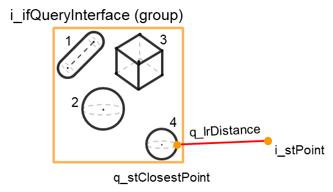
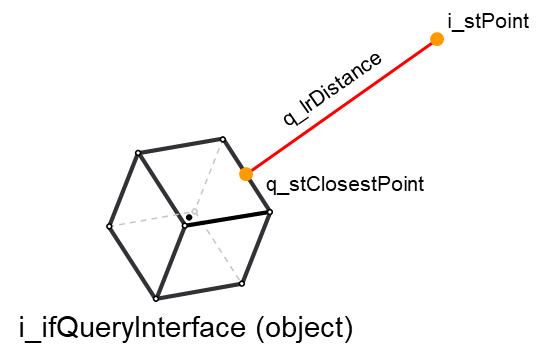

# FC\_PointDistanceQuery - General Information

## Overview

|  |  |
| --- | --- |
| Type: | Function |
| Available as of: | V1.0.0.0 |
| Versions: | Current version |

This chapter provides information on:

* [Description](#FC_PointDistanceQuery-GeneralInform-B9C5A70E__Description-BA2AC52B)
* [Interface](#FC_PointDistanceQuery-GeneralInform-B9C5A70E__Interface-B9C65040)
* [Diagnostic Messages](#FC_PointDistanceQuery-GeneralInform-B9C5A70E__DiagnosticMessages-B9C77325)
* [Examples](#FC_PointDistanceQuery-GeneralInform-B9C5A70E__Examples-BA284C5A)

## Description

This function requires a Cartesian point and one query interface implementation chosen between a collision object, a collision group or a collision entity as inputs.

As a result, it returns:

* The minimum distance between the point and the query interface object
* If i\_xEvaluateClosestPoint is set to TRUE, the function evaluates the closest point on the query interface object

## Interface

| Input | Data type | Description |
| --- | --- | --- |
| i\_stPoint | SE\_MATH.ST\_Vector3D | A Cartesian point. |
| i\_ifQueryInterface | [IF\_CollisionQueryInterface](IF_CollisionQueryInterfaceGeneralIn-9FFDD96D.html#IF_CollisionQueryInterfaceGeneralIn-9FFDD96D) | An object implementing IF\_CollisionQueryInterface. This can be a collision object, a collision group or a collision entity. |
| i\_xEvaluateClosestPoints | BOOL | If TRUE, the closest point on i\_ifQueryInterface is evaluated |

| Output | Data type | Description |
| --- | --- | --- |
| q\_xError | BOOL | The output is set to TRUE if an error has been detected during the execution. |
| q\_etResult | [ET\_Result](ET_ResultEnumerator-9BCEF714.html#ET_ResultEnumerator-9BCEF714) | POU-specific output on the diagnostic; q\_xError = FALSE -> Status message; q\_xError = TRUE -> Diagnostic message. |
| q\_sResultMsg | String | Event-triggered message that gives additional information on the diagnostic state. |
| q\_xIsPointInside | BOOL | TRUE if the point is inside i\_ifQueryInterface. |
| q\_lrDistance | LREAL | The minimum distance between the two inputs. This is zero if q\_xCollision = TRUE. |
| q\_udiCollisionGroupIndex | UDINT | Index of the closest group for the input i\_ifQueryInterface.  NOTE: This has a zero value if i\_ifQueryInterface is referring to a collision object or a collision group. |
| q\_udiCollisionObjectIndex | UDINT | Index of the closest object in the group with index q\_udiCollisionGroupIndex of the input i\_ifQueryInterface.  NOTE: This has a zero value, if i\_ifQueryInterface is referring to a collision object. |
| q\_stClosestPoint | SE\_Math.ST\_Vector3D | Closest point for the input i\_ifQueryInterface.  This is only evaluated if i\_xEvaluateClosestPoint = TRUE; otherwise, it will return a null vector. |

## Diagnostic Messages

| q\_xError | q\_etResult | Enumeration value | Description |
| --- | --- | --- | --- |
| FALSE | [Ok](#FC_PointDistanceQuery-GeneralInform-B9C5A70E__OK-BA2899E7)Ok | 0 | Success |
| TRUE | [NoCollisionGroupsEnabled](#FC_PointDistanceQuery-GeneralInform-B9C5A70E__NoCollisionGroupsEnabled-BA289826) | 36 | No collision groups enabled. |
| TRUE | [InterfaceInvalid](#FC_PointDistanceQuery-GeneralInform-B9C5A70E__InterfaceInvalid-BA289510) | 11 | The provided interface is invalid (null). |
| TRUE | [CollisionEntityNotUpdated](#FC_PointDistanceQuery-GeneralInform-B9C5A70E__CollisionEntityNotUpdated-BA289286) | 34 | The collision entity has not been updated. |
| TRUE | [CollisionGroupNotUpdated](#FC_PointDistanceQuery-GeneralInform-B9C5A70E__CollisionGroupNotUpdated-BA289E1A) | 21 | A collision group is not updated. |
| TRUE | [CollisionObjectTypeInvalid](#FC_PointDistanceQuery-GeneralInform-B9C5A70E__CollisionObjectTypeInvalid-BA28AFE9) | 16 | The provided collision object type is invalid. |
| TRUE | [CollisionObjectNotConfigured](#FC_PointDistanceQuery-GeneralInform-B9C5A70E__CollisionObjectNotConfigured-BA28B47A) | 12 | The object is not configured. |
| TRUE | [CollisionQueryInterfaceTypeInvalid](#FC_PointDistanceQuery-GeneralInform-B9C5A70E__CollisionQueryInterfaceTypeInvalid-BA28B7F9) | 52 | The provided collision query interface is referring to an invalid type. |

## OK

|  |  |
| --- | --- |
| Enumeration name: | Ok |
| Enumeration value: | 0 |
| Description: | Success |

## NoCollisionGroupsEnabled

|  |  |
| --- | --- |
| Enumeration name: | NoCollisionGroupsEnabled |
| Enumeration value: | 36 |
| Description: | No collision groups enabled. |

| Issue | Cause | Solution |
| --- | --- | --- |
| Not possible to make a collision query | i\_ifQueryInterface refers to a collision entity. All the configured collision groups of that entity are disabled, meaning that all the relative elements of raxEnableCollisionGroups are set to FALSE. | Make sure to enable the groups of the entity that you want to query for collision. |

## InterfaceInvalid

|  |  |
| --- | --- |
| Enumeration name: | InterfaceInvalid |
| Enumeration value: | 11 |
| Description: | The provided interface is invalid (null). |

| Issue | Cause | Solution |
| --- | --- | --- |
| Not possible to make a collision query. | i\_ifQueryInterface contains an invalid interface. | Make sure that i\_ifQueryInterface is not null. |

## CollisionEntityNotUpdated

|  |  |
| --- | --- |
| Enumeration name: | CollisionEntityNotUpdated |
| Enumeration value: | 34 |
| Description: | The collision entity has not been updated. |

| Issue | Cause | Solution |
| --- | --- | --- |
| Not possible to make a collision query. | i\_ifQueryInterface refers to a collision entity that is not updated, meaning that its property xUpdated = FALSE. | Make sure that an entity is updated before providing it as input of this function. |

## CollisionGroupNotUpdated

|  |  |
| --- | --- |
| Enumeration name: | CollisionGroupNotUpdated |
| Enumeration value: | 21 |
| Description: | A collision group is not updated. |

| Issue | Cause | Solution |
| --- | --- | --- |
| Not possible to make a collision query. | i\_ifQueryInterface refers to a collision group that is not updated, meaning that its property xUpdated = FALSE. | Make sure that a group is updated before providing it as input of this function. |

## CollisionObjectTypeInvalid

|  |  |
| --- | --- |
| Enumeration name: | CollisionObjectTypeInvalid |
| Enumeration value: | 16 |
| Description: | The provided collision object type is invalid. |

| Issue | Cause | Solution |
| --- | --- | --- |
| Not possible to make a collision query. | i\_ifQueryInterface refers to a collision object with an invalid collision object type. | Make sure that i\_ifQueryInterface refers to a collision object with a valid collision object type.  The valid types are:   * ET\_CollisionObjectType.AABB * ET\_CollisionObjectType.OBB * ET\_CollisionObjectType.Sphere * ET\_CollisionObjectType.Capsule |

## CollisionObjectNotConfigured

|  |  |
| --- | --- |
| Enumeration name: | CollisionObjectNotConfigured |
| Enumeration value: | 12 |
| Description: | The object is not configured. |

| Issue | Cause | Solution |
| --- | --- | --- |
| Not possible to make a collision query. | i\_ifQueryInterface refers to a collision object that is not configured, meaning that its property xConfigured = FALSE. | Make sure that an object is configured before providing it as input of this function. |

## CollisionQueryInterfaceTypeInvalid

|  |  |
| --- | --- |
| Enumeration name: | CollisionQueryInterfaceTypeInvalid |
| Enumeration value: | 52 |
| Description: | The provided collision query interface is referring to an invalid type. |

| Issue | Cause | Solution |
| --- | --- | --- |
| Not possible to make a collision query. | i\_ifQueryInterface is referring to an invalid object type. | Make sure that i\_ifQueryInterface is referring to a collision object, group or entity. |

## Examples

Example of distance query between a point and i\_ifQueryInterface (group). In this case, q\_udiCollisionObjectIndex = 4 that is the index of the closest object within the group.

Example of distance query between a point and i\_ifQueryInterface (object); in this case, q\_udiCollisionGroupIndex and q\_udiCollisionObjectIndex are both null since i\_ifQueryInterface refers to a collision object.

EIO0000004468.00

© 2021

Schneider Electric.

All rights reserved.