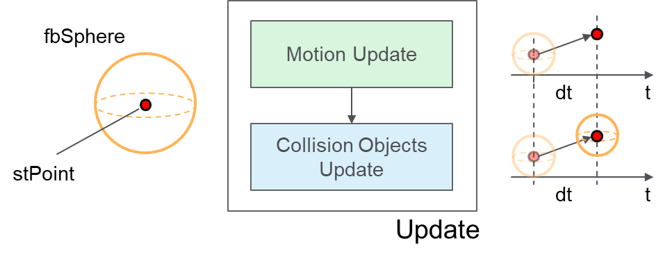

# Update a Collision Object

## Overview

This section shows an example of how a collision object can be updated according to the motion of a physical object.

Collision objects update:



As shown in the figure, the update cycle can be split into two separate updates:

1. **Motion Update**: First, it is necessary to update the motion within the project, to make sure that all the positions represented in the system are representative of the current state of the machine.
2. **Collision Objects Update**: Then, based on the data coming from the motion update, it is possible to perform an update of the individual collision objects modelling the physical moving parts.

From a library point of view, updating the position, the orientation or even the size of a collision object at runtime is performed by calling a Set method for that specific object.

For example, with reference to the figure where a Sphere object is used to encapsulate a point defined as stPoint, the update could be as follows:

```
   fbSphere.SetCenterRadius(
      i_stCenter := stPoint,
      i_lrRadius := lrRadius, //<- this could also vary on each Set call if required
      q_xError => xError, 
      q_etResult => etResult, 
      q_sResultMsg=> sResultMsg
);
```

The update of the collision objects could also be split into separate phases:

1. **Update of the Collision Objects**: This is only necessary when a collision object is representing a moving part.
2. **Update the Collision Groups**: The collision groups need to be updated every time one or more of the configured objects are updated (i.e. a Set method has been called on those objects).
3. **Update the Collision Entities**: The collision entities need to be updated every time one or more of the configured groups are updated. The Update method of an entity allow to automatically force the update of the contained groups.

EIO0000004468.00

© 2021

Schneider Electric.

All rights reserved.