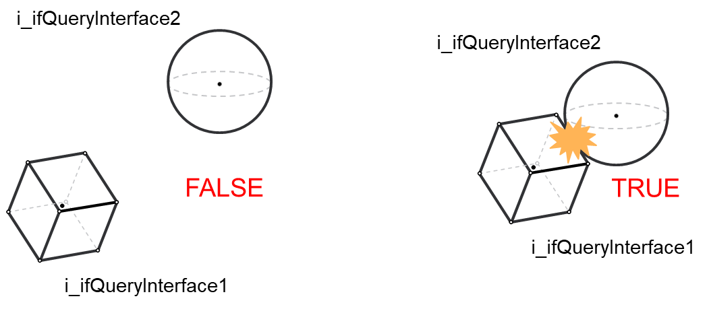

# Using FC\_CollisionQuery

## Overview

It is possible to perform a collision query by calling the function [FC\_CollisionQuery](FC_CollisionQuery-GeneralInformatio-B9AA39D0.html#FC_CollisionQuery-GeneralInformatio-B9AA39D0). The function expects two objects implementing the interface COD.IF\_CollisionQueryInterface.

Collision objects, groups and entities are all valid implementations of the [IF\_CollisionQueryInterface](IF_CollisionQueryInterfaceGeneralIn-9FFDD96D.html#IF_CollisionQueryInterfaceGeneralIn-9FFDD96D), meaning that you may provide any combination of them as inputs for the function.

## Performing a Collision Query

The following steps are required to perform a collision query:

| Step | Action |
| --- | --- |
| 1 | Define a first collision object, group or entity and make sure it has xConfigured = TRUE in the case of an object or xUpdated = TRUE in the case of a group or an entity. |
| 2 | Define a second collision object, group or entity and make sure it has xConfigured = TRUE in the case of an object or xUpdated = TRUE in the case of a group or an entity. |
| 3 | Provide those objects as inputs of the FC\_CollisionQuery function. |

On a successful call of FC\_CollisionQuery, the function will return TRUE if a collision between the inputs have been detected, or FALSE otherwise.

Examples of collision queries between two collision objects:



Example in the case of two collision objects:

```
//configure the first object that is an OBB
fbOBB.SetCenterHalfExtentsOrientation(
      i_stCenter := stOBBCenter,
      i_stHalfExtents := stOBBHalfExtents,
      i_stOrientation := stOBBOrientation,
      q_xError=> xError,
      q_etResult=> etResult,
      q_sResultMsg=> sResultMsg
);

//check diagnostics here
IF xError THEN
      //do something to handle the error
      …
END_IF

//configure the second object that is a Sphere
fbSphere.SetCenterRadius(
      i_stCenter := stSphereCenter,
      i_lrRadius := lrSphereRadius,
      q_xError=> xError,
      q_etResult=> etResult,
      q_sResultMsg=> sResultMsg
);

//check diagnostics here
IF xError THEN
      //do something to handle the error
      …
END_IF

//now that both the objects are configured, it is possible to perform a collision query
xCollision := COD.FC_CollisionQuery(
      i_ifQueryInterface1:= fbOBB, 
      i_ifQueryInterface2:= fbSphere,
      q_xError=> xError,
      q_etResult=> etResult,
      q_sResultMsg=> sResultMsg
);
```

EIO0000004468.00

© 2021

Schneider Electric.

All rights reserved.