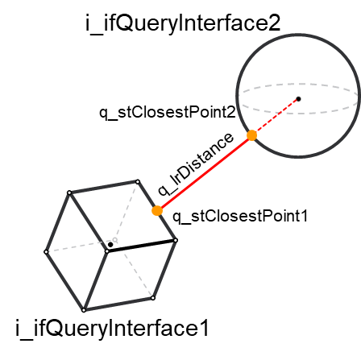

# Using FC\_DistanceQuery

## Overview

It is possible to perform a distance query by calling the function FC\_DistanceQuery. The function expects two objects implementing the interface COD.IF\_CollisionQueryInterface.

Collision objects, groups and entities are valid implementations of the [IF\_CollisionQueryInterface](IF_CollisionQueryInterfaceGeneralIn-9FFDD96D.html#IF_CollisionQueryInterfaceGeneralIn-9FFDD96D), meaning that you may provide any combination of them as inputs for the function.

There is a third input called i\_xEvaluateClosestPoints that, if set to TRUE, forces the function to evaluate the closest points between the inputs.

The following list of minimum steps is required to perform a distance query:

| Step | Action |
| --- | --- |
| 1 | Define a first collision object, group or entity and make sure it has xConfigured = TRUE in the case of an object, or xUpdated = TRUE in the case of a group or an entity. |
| 2 | Define a second collision object, group or entity and make sure it has xConfigured = TRUE in the case of an object, or xUpdated = TRUE in the case of a group or an entity. |
| 3 | Provide these objects as inputs of the FC\_DistanceQuery function |

On a successful call of FC\_DistanceQuery, the function will return information about the distance between the two inputs.

Distance query between two collision objects:



## Example

Example in the case of two collision objects:

```
//configure the first object that is an OBB
fbOBB.SetCenterHalfExtentsOrientation(
      i_stCenter := stOBBCenter,
      i_stHalfExtents := stOBBHalfExtents,
      i_stOrientation := stOBBOrientation, 
      q_xError=> xError,
      q_etResult=> etResult,
      q_sResultMsg=> sResultMsg
);

//check diagnostics here
IF xError THEN
      //do something to handle the error
      …
END_IF
```

```
//configure the second object that is a Sphere
fbSphere.SetCenterRadius(
      i_stCenter := stSphereCenter,
      i_lrRadius := lrSphereRadius
      q_xError=> xError,
      q_etResult=> etResult,
      q_sResultMsg=> sResultMsg
);

//check diagnostics here
IF xError THEN
      //do something to handle the error
      …
END_IF
```

```
//now that both the objects are configured, it is possible to perform a distance query
COD.FC_DistanceQuery(
      i_ifQueryInterface1:= fbOBB, 
      i_ifQueryInterface2:= fbSphere, 
      i_xEvaluateClosestPoints:= TRUE,
      q_xError=> xError,
      q_etResult=> etResult,
      q_sResultMsg=> sResultMsg,
      q_xCollision=> xCollision,
      q_lrDistance=> lrDistance,
      q_stClosestPoint1=> stClosestPoint1,
      q_stClosestPoint2=> stClosestPoint2
);
```

EIO0000004468.00

© 2021

Schneider Electric.

All rights reserved.