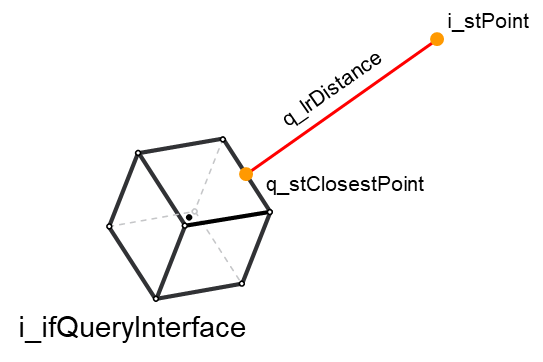

# Using FC\_PointDistanceQuery

## Overview

It is possible to perform a point distance query by calling the function [FC\_PointDistanceQuery](FC_PointDistanceQuery-GeneralInform-B9C5A70E.html) The function expects one Cartesian 3D point and object implementing the interface COD.IF\_CollisionQueryInterface.

Collision objects, groups and entities are valid implementations of the [IF\_CollisionQueryInterface](IF_CollisionQueryInterfaceGeneralIn-9FFDD96D.html#IF_CollisionQueryInterfaceGeneralIn-9FFDD96D), meaning that you may provide any of them as input for the function.

There is a third input called i\_xEvaluateClosestPoint that, if set to TRUE, forces the function to evaluate the closest point on the IF\_CollisionQueryInterface input.

The following list of minimum steps is required to perform a point distance query:

| Step | Action |
| --- | --- |
| 1 | Define a collision object, group or entity and make sure it has xConfigured = TRUE in the case of an object, or xUpdated = TRUE in the case of a group or an entity. |
| 2 | Provide the 3D point and the IF\_CollisionQueryInterface implementation as inputs of the FC\_PointDistanceQuery function. |

On a successful call of FC\_PointDistanceQuery, the function returns information about the distance between the point and the IF\_CollisionQueryInterface implementation.

Example of point distance query:



## Example

The following is an example in the case of a collision object:

```
//configure the object that is an OBB
fbOBB.SetCenterHalfExtentsOrientation(
      i_stCenter := stOBBCenter,
      i_stHalfExtents := stOBBHalfExtents,
      i_stOrientation := stOBBOrientation, 
      q_xError=> xError,
      q_etResult=> etResult,
      q_sResultMsg=> sResultMsg
);

//check diagnostics here
IF xError THEN
      //do something to handle the error
      …
END_IF
```

```
//now that the OBB object is configured, it is possible to 
//perform a point distance query
COD.FC_PointDistanceQuery(
      i_stPoint:= stPoint,
      i_ifQueryInterface:= fbOBB,  
      i_xEvaluateClosestPoint:= FALSE,
      q_xError=> xError,
      q_etResult=> etResult,
      q_sResultMsg=> sResultMsg,
      q_xIsPointInside=> xIsPointInside,
      q_lrDistance=> lrDistance,
      q_stClosestPoint=> stClosestPoint
);
```

EIO0000004468.00

© 2021

Schneider Electric.

All rights reserved.