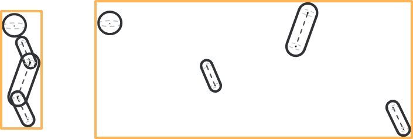
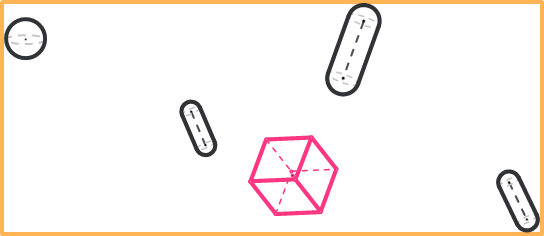

# Handling of the Objects Inside Groups and Entities

## Overview

Having an overview about how the collision objects are handled when added to a group or, indirectly, to an entity could influence some configuration choices.

When the collision objects are added to a group, they are inserted in an internal list. On a call of the Update method of the group, the library verifies that each object is properly configured (xConfigured = TRUE), and evaluates a bounding box that encapsulates all the objects in the group.

Such bounding box is used, for example, to perform a preliminary collision query between the group and another collision query interface (i.e. object, group or entity). If there is no collision between the box encapsulating all the objects in the group and the other collision query interface, then the function returns FALSE. Therefore, if the encapsulating box does not collide with another collision query interface, then none of the objects that it is encapsulating can collide.

Having such behavior in mind could become relevant when deciding which collision objects belong to the same collision group.

## Examples of Collision Groups

The following graphics show two examples of collision objects grouping:

The four grouped objects have the same shape and size in the two examples, the only thing that changes is how those objects are organized in space.

* In the example on the left-hand side, the objects belong to the same kinematics chain and they model some physically connected mechanical parts. The result of this is that the evaluated bounding box (here represented as a rectangle for simplicity) has a volume that is comparable to the sum of the volumes of the single objects.
* In the example on the right-hand side, the objects represent individual parts that have been added to the same group. The result of this is that the evaluated bounding box has a volume that is much greater than the sum of the volumes of the single objects.
* Most of the time, the example on the right-hand side should be avoided, because having a group where most of the encapsulated volume is just empty space would easily cause a false positive when the box is checked for collision versus another collision query interface.

## Example of a False Positive

Example of a false positive for the encapsulating box:

* The pink box in the graphic is not colliding with any of the collision objects in the group. Still, while performing a preliminary query on the encapsulating box of the group, the library would detect that there is a collision. As a result of that, the library would need to perform additional calculation to verify if there is a collision or not.
* The final collision query result would still be correct (for example, no collision in this case) but if the encapsulating volume is much bigger than the sum of the volumes of the objects in the group (meaning that the objects are spread out in space), on the average, the library would need to perform much more calculations to get to the actual result.
* The same consideration applies to the collision entities, where it makes sense to add groups that are near in space or even mechanically connected (for example, the chains of a Delta robot).

EIO0000004468.00

© 2021

Schneider Electric.

All rights reserved.