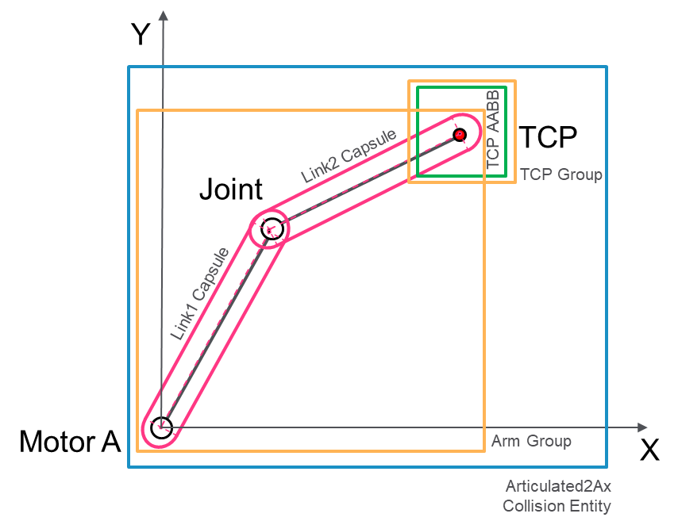
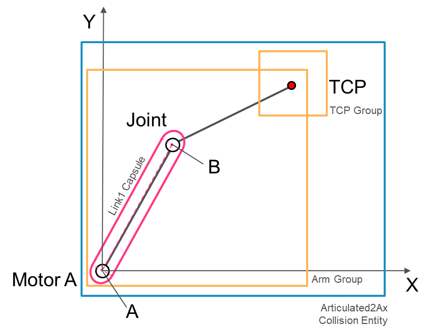
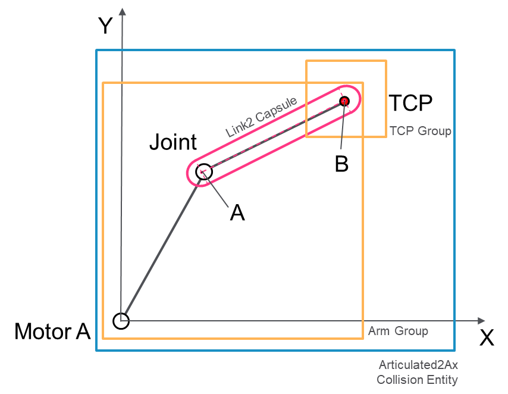
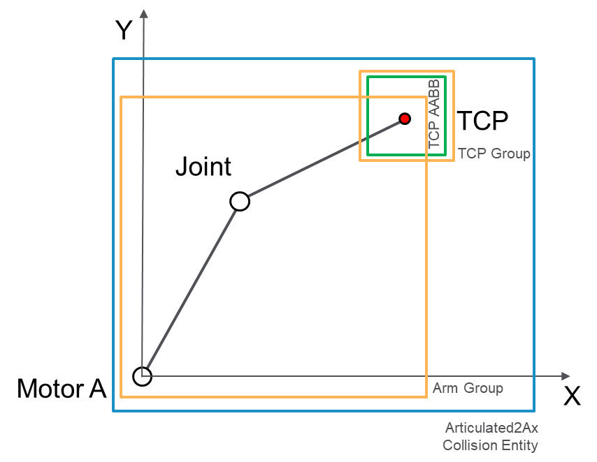

# Creating and Updating a Custom Collision Entity for an Articulated2Ax Robot

## Overview

The following graphic presents an example of definition of a collision entity for an Articulated2Ax robot:



* **ArmGroup**: it will contain two Capsule objects modelling the two links of the robot
* **TCP Group**: it will contain an AABB object modelling the TCP of the robot

The following list includes the steps for the definition of a collision entity:

* [Definition of the required objects](#CreatingAndUpdatingACustomCollision-BF56D256__DefinitionOfTheRequiredObjects-BF5AA985)
* [Configuration of the collision groups and of the collision entity; this step only requires to be performed once](#CreatingAndUpdatingACustomCollision-BF56D256__ConfigurationOfTheCollisionGroups-BF5B08D6)
* [Runtime update of the collision objects](#CreatingAndUpdatingACustomCollision-BF56D256__RuntimeUpdate-BF5BBE76)

## Definition of the Required Objects

```
//objects that will be used for the Arm Group
fbLink1Capsule : COD.FB_Capsule;
fbLink2Capsule : COD.FB_Capsule;
fbArmGroup : COD.FB_CollisionGroup;

//objects that will be used for the TCP Group
fbTCPBox : COD.FB_AABB;
fbTCPGroup : COD.FB_CollisionGroup;

//the collision entity that would encapsulate the two groups
fbRobotEntity : COD.FB_CollisionEntity;
```

## Configuration of the Collision Groups

Configuration of the collision groups and of the collision entity. This step needs to be performed only once.

```
(* Arm Group *)

//add the capsule modelling link 1 to the arm group
fbArmGroup.AddCollisionObject(
      i_ifCollisionObject := fbLink1Capsule,
      q_xError => xError,
      q_etResult => etResult,
      q_sResultMsg => sResultMsg
 );

//add the capsule modelling link 2 to the arm group
fbArmGroup.AddCollisionObject(
      i_ifCollisionObject := fbLink2Capsule,
      q_xError => xError,
      q_etResult => etResult,
      q_sResultMsg => sResultMsg
);

(* TCP Group *)

//add the AABB to the TCP group
fbTCPGroup.AddCollisionObject(
      i_ifCollisionObject := fbBoxTCP,
      q_xError => xError,
      q_etResult => etResult,
      q_sResultMsg => sResultMsg
);

(* Robot Entity *)

//add the Arm group to the entity
fbRobotEntity.AddCollisionGroup(
      i_ifCollisionGroup := fbArmGroup,
      q_xError => xError,
      q_etResult => etResult,
      q_sResultMsg => sResultMsg
);

//add the TCP group to the entity
fbRobotEntity.AddCollisionGroup(
      i_ifCollisionGroup := fbTCPGroup,
      q_xError => xError,
      q_etResult => etResult,
      q_sResultMsg => sResultMsg
);
```

## Runtime Update

Runtime update of the collision objects based on the current motion state of the module. In this case, the required positions along the kinematics chain are acquired from the feedback interface of the robotic module (for example, ROB.IF\_RobotFeedback). To perform an update of the collision entity, it is required to first update the single collision objects and then call the Update method of the entity.

**Link 1 Capsule points:**



```
(* Link 1 Capsule *)

//prepare point A for the Capsule of link 1
stCapsuleStart.lrX := ifFeedback.ifKinematic. ifMechRefPositionArticulated2Ax.rastMotor[ROB.ET_RobotComponent.AxisA].lrX;
stCapsuleStart.lrY := ifFeedback.ifKinematic. ifMechRefPositionArticulated2Ax.rastMotor[ROB.ET_RobotComponent.AxisA].lrY;
stCapsuleStart.lrZ := 0.0;

//prepare point B for the Capsule of link 1
stCapsuleEnd.lrX := ifFeedback.ifKinematic.ifMechRefPositionArticulated2Ax.rstJoint.lrX;
stCapsuleEnd.lrY := ifFeedback.ifKinematic.ifMechRefPositionArticulated2Ax.rstJoint.lrY;
stCapsuleEnd.lrZ := 0.0;

//set the points and the radius of the Capsule of link 1; the radius is set to 20mm
fbLink1Capsule.SetPointsRadius(
      i_stPointA := stCapsuleStart,
      i_stPointB := stCapsuleEnd,
      i_lrRadius := 20.0, 
      q_xError => xError,
      q_etResult => etResult,
      q_sResultMsg => sResultMsg
);
```

**Link 2 Capsule points:**



```
(* Link 2 Capsule *)

//prepare point A for the Capsule of link 2
stCapsuleStart.lrX := ifFeedback.ifKinematic.ifMechRefPositionArticulated2Ax.rstJoint.lrX;
stCapsuleStart.lrY := ifFeedback.ifKinematic.ifMechRefPositionArticulated2Ax.rstJoint.lrY;
stCapsuleStart.lrZ := 0.0;

//prepare point B for the Capsule of link 2
stCapsuleEnd.lrX := ifFeedback.ifKinematic.rstMechRefPositionTCP.lrX;
stCapsuleEnd.lrY := ifFeedback.ifKinematic.rstMechRefPositionTCP.lrY;
stCapsuleEnd.lrZ := 0.0;

//set the points and the radius of the Capsule of link 2; the radius is set to 20mm
fbLink2Capsule.SetPointsRadius(
      i_stPointA := stCapsuleStart,
      i_stPointB := stCapsuleEnd,
      i_lrRadius := 20.0, 
      q_xError => xError,
      q_etResult => etResult,
      q_sResultMsg => sResultMsg
);
```

**TCP AABB centered on the TCP position:**



```
(* TCP Box *)

//set center and half extents for the AABB of the TCP
fbBoxTCP.SetCenterHalfExtents(
i_stCenter := ifFeedback.ifKinematic.rstMechRefPositionTCP,
      i_stHalfExtents := GEM.FC_Vector3DSetElements(50.0, 50.0, 50.0),
      q_xError => xError,
      q_etResult => etResult,
      q_sResultMsg => sResultMsg
);
	

(* Entity Update *)

//after the single collision objects have been updated, update the entity
fbRobotEntity.Update(
      i_xUpdateGroups := TRUE, //<-this will force an update of the Arm and TCP groups
      q_xError => xError,
      q_etRsult => etResult,
      q_sResultMsg => sResultMsg
);
```

In this case, setting i\_xUpdateGroups = TRUE forces the automatic update of fbArmGroup and fbTCPGroup that are the two groups that have been configured inside the entity.

After the update has been successfully performed, fbRobotEntity can be used as input for the collision and distance query functions.

EIO0000004468.00

© 2021

Schneider Electric.

All rights reserved.