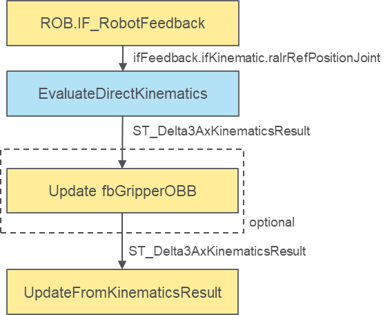
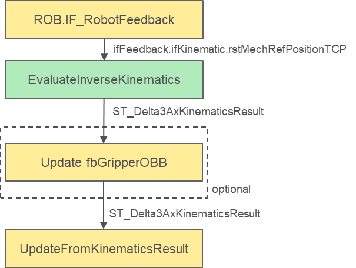

# Adding a User Object or Group to a Collision Handler

## Overview

This section explains how to insert a custom user object or group to a configured collision handler. For a basic example of definition for a collision handler, refer to [Defining a Collision Handler](DefiningACollisionHandler-BE5C1AFE.html#DefiningACollisionHandler-BE5C1AFE).

NOTE:

* It is possible to add custom objects or groups to the collision entity managed by a collision handler by accessing the methods inside the IF\_CollisionHanlder.ifCollisionEntity interface.
* Every time a collision handler is configured, the managed collision handler is automatically reset and then configured: this means that custom objects and groups are added after the standard configuration of a collision handler has been successfully performed, otherwise all the custom objects are lost.

An example of custom object is the case of a gripper mounted on the TCP, which update requires the position and orientation of the TCP.

An OBB modelling the gripper could be added to the default TCP group of a robot. For example, in the case of a Delta3Ax robot:

```
fbCollisionHandlerDelta3Ax.ifCollisionEntity.raifCollisionGroups[COD.ET_Delta3AxCollisionGroupIndex.TCP].AddCollisionObject(
      i_ifCollisionObject := fbGripperOBB,
      q_xError => xError,
      q_etResult => etResult,
      q_sResultMsg =>sResultMsg
);
```

NOTE: This must be done after a successful call of fbCollisionHandlerDelta3Ax.SetParameters(…).

Refer also to [FB\_CollisionHandlerDelta3Ax - SetParameters (Method)](FB_CollisionHandlerDelta3Ax-SetPara-BDC25E9D.html#FB_CollisionHandlerDelta3Ax-SetPara-BDC25E9D).

After adding a collision object, perform an update of the individual collision object fbGripperOBB. To do so, it is possible to rely on the result of the kinematics provided by EvaluateDirectKinematics or EvaluateInverseKinematics

**Example of custom object updated using the result of the direct kinematics:**



**Example of custom object updated using the result of the direct kinematics:**



* The handling of fbGripperOBB inside the robot collision entity is automatically managed by the collision handler on a call of UpdateFromKinematicsResult.
* Considering the example, the object is now part of the TCP group, meaning that it is affected by the flag fbCollisionHanlderDelta3Ax.xEnableTCPCollisionGroup.
* In general, fbGripperOBB is now considered part of the robot collision entity for the purpose of collision and distance queries.

.

EIO0000004468.00

© 2021

Schneider Electric.

All rights reserved.