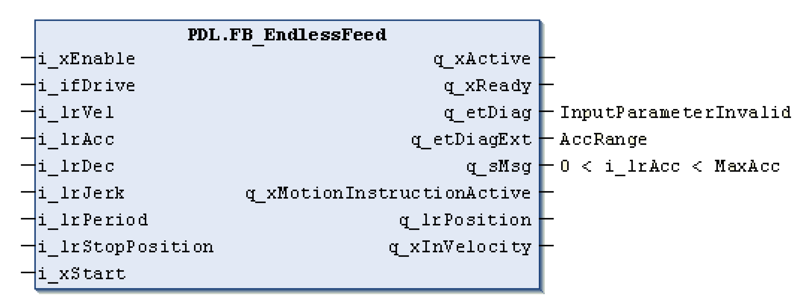

# Function Blocks

Function Blocks

Function blocks have the three outputs q\_etDiag, q\_etDiagExt, and optional q\_sMsg. The outputs are displayed grouped; that is, defined in the POU one after another.

Using schematic POU structure, the following is an example of a function block:

| Output | Data type | Meaning |
| --- | --- | --- |
| q\_etDiag | GD.ET\_Diag | General statement on the diagnostic, for example InputParameterInvalid.  NOTE: If possible, GD.ET\_Diag contains general formulated diagnostic codes (for example: DriveConditionInvalid and InputParameterInvalid). Every enumeration element is not only represented by a name, it is also represented by a value. This value can then be used by the HMI so that the translation effort for a neutral language solution of the enumeration name remains maintainable.  oGD.ET\_Diag.Ok: The status message q\_etDiagExt gives information about the status of the POU.  o<> GD.ET\_Diag.Ok: The diagnostic message q\_etDiagExt gives information about the exception type. |
| q\_etDiagExt | ET\_DiagExt | Extended diagnostic information encoded into a value of the function or service performed within the POU. For example, AccRange (Acceleration is out of range)/ WaitForStart may be output as a diagnostic or as a status.  q\_etDiagExt provides the numeric value that serves as the index of a more detailed indication of the cause of the output and can be further used as an index into a multi-language set of display messages. |
| q\_sMsg | STRING[80] | Event triggered optional message that gives more detailed information on the diagnostic condition (for example, 0 < i\_lrAcc < MaxAcc).  q\_sMsg provides a dynamic string containing variable information about the diagnostic in English.  q\_sMsg is modified during runtime. For example, by the exception VelRange: ActualValue: 5003, MaxValue: 5000.  During the normal operation of the POUs (q\_etDiag=GD.ET\_Diag.Ok), q\_sMsg may provide information concerning the status (for example, the remaining sealing time). |

Diagnostic information example:

