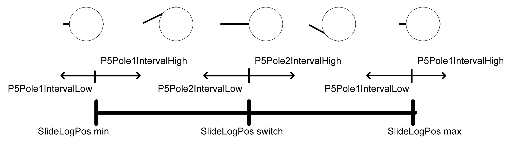

# P5RangeLowRange

P5RangeLowRange

|  |  |
| --- | --- |
| Enumeration name: | P5RangeLowRange |
| Enumeration value: | 159 |
| Description: | P5RangeLow is outside the valid range. |

| Issue | Cause | Solution |
| --- | --- | --- |
| - | The overlapping of the polynomial intervals was selected so that the X part of a polynomial becomes 0. | The inputs iq\_stCrankData.lrP5Pole1IntervalLow, iq\_stCrankData.lrP5Pole1IntervalHigh, iq\_stCrankData.lrP5Pole2IntervalLow and iq\_stCrankData.lrP5Pole2IntervalHigh must be selected so that not the entire interval range for iq\_stCrankData.lrP5Pole1IntervalLow and iq\_stCrankData.lrP5Pole2IntervalLow is forced into a straight line due to overlapping. |

