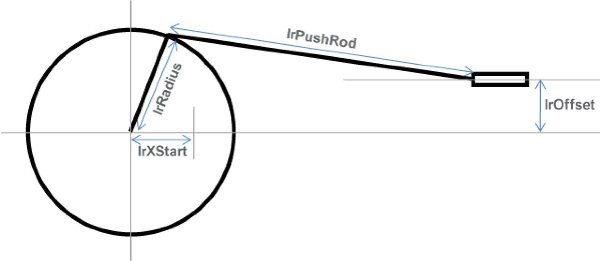

# Mechanics

Mechanics

Definition of the dimensions

The values of the crank radius (lrRadius) and the push rod length (lrPushRod) are always absolute. Whereas the values of lrXStart (zero position for the slide movement scale) and lrOffset (vertical distance of the slide center to the centre of crank) are not absolute.

Determination of the push rod orientation

Determination of the dimensions

stCrankModuleItf.stCrank.lrRadius := 50.0; (\* Crank radius \*)  
stCrankModuleItf.stCrank.lrPushRod := 157.2; (\* Length \*)  
stCrankModuleItf.stCrank.lrOffset := 0.0; (\* Distance crank center to slide level \*)  
stCrankModuleItf.stCrank.lrXStart := 7.2; (\* Distance crank center to 0-position of slide \*)  
stCrankModuleItf.stCrank.diXLogEqualXMechRange := 1; (\* Range where logical position equals mechanical position of slide \*)

| Push rod facing right | Push rod facing left |
| --- | --- |
| Determination of the push rod orientation (right)  stCrankModuleItf.stCrank.xCrankLeft := FALSE;  (\* TRUE = Crank on the left hand side \*)  (\* FALSE = Crank on the right hand side \*) | Determination of the push rod orientation (left)  stCrankModuleItf.stCrank.xCrankLeft := TRUE;  (\* TRUE = Crank on the left hand side \*)  (\* FALSE = Crank on the right hand side \*) |