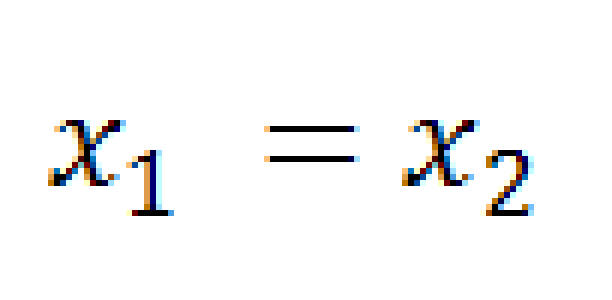
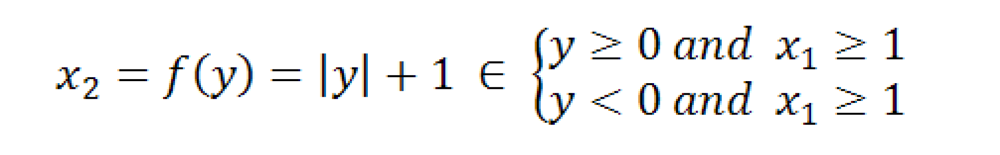
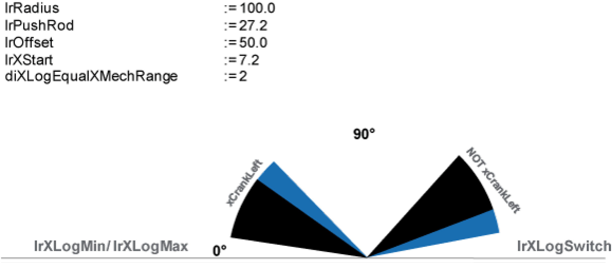

# xRange

xRange

The variable xRange is only considered if the following criteria is fulfilled:

To verify this criteria proceed as follows:

First, calculate the x1 and y values as shown in the following graph and map them:

Secondly, take the y value and calculate the x2 value by using the formula below:

If x1 = x2, then:

ofor a LEFT motion range

stMain. stCrank.xRange := TRUE

ofor a RIGHT motion range

stMain. stCrank.xRange := FALSE

Example:

