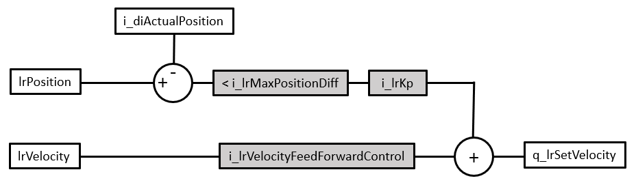

# FB\_Drive\_PosControl - General Information

## Overview

|  |  |
| --- | --- |
| Type: | Function block |
| Available as of: | V2.5.0.0 |
| Inherits from: | - |
| Implements: | - |

## Task

This function block allows for position control of a velocity-controlled drive with position feedback through an encoder. Usually, the motion controller provides the target position for a position-controlled movement. The control loops in the servo drive are then in charge of position control (as well as current control and velocity control) for the movement. This function block allows you to operate a velocity-controlled drive such as a variable speed drive using position control through the logic/motion controller, not by the drive itself (that may not provide the required position control functionality).

## Description

**Overview**

The function block uses a virtual axis of the type MOIN.FB\_ControlledAxis as its input. A position-controlled movement of this virtual axis (for example, using the function block MC\_MoveAbsolute or the function block MC\_MoveRelative) provides the actual position (as determined by the encoder) of the movement using the input i\_diActualPosition.

Based on this position input and the scaling parameters of the encoder (inputs i\_diIncrementalResolution and i\_lrPositionResolution), the function block FB\_Drive\_PosControl calculates the output velocity for the drive in RPM (output q\_diSetVelocity) or in user-defined units for every second (output q\_lrSetVelocity) as reference values for the movement to the target position.

The profile generator follows the PLCopen standard in generating the position values.

**Axis Type**

The axis at the input i\_ifAxis has to be of the type MOIN.FB\_ControlledAxis. The axis has to be a virtual axis; that is, it is not connected to a drive. If the axis at the input i\_ifAxis is not of the type MOIN.FB\_ControlledAxis, an error is detected (ET\_Result is set to OnlyControlledAxisSupported). If the axis at the input i\_ifAxis is of the type MOIN.FB\_ControlledAxis, but it is not a virtual axis (that is, it is connected to a drive), an error is detected (ET\_Result is set to ControlledAxisIsConnectedToDevice).

**Control Loop**

Representation of the control loop:

* Items with a gray background are parameters that determine the control performance.
* Items with a leading “i\_” are inputs of the function block FB\_Drive\_PosControl.
* Items with a leading “q\_” are outputs of the function block FB\_Drive\_PosControl.
* lrPosition is the target position for the movement.
* lrVelocity is the input velocity from the application.
* i\_diActualPosition is the actual position as determined by the encoder.
* i\_lrMaxPositionDiff is the position deviation. Position deviation is the difference between the reference position (lrPosition of the virtual axis) and the actual position of the drive at the input i\_diActualPosition as determined by the encoder.
* i\_lrKp is the proportional gain. The proportional gain of the control loop reduces the position deviation. The proportional gain is a reactive correction intended to reduce the position deviation that has already occurred.
* i\_VelocityFeedForwardControl is the velocity feed-forward gain. The velocity feed-forward gain is a proactive correction to reduce predictable overshoot or further minimize the position deviation during the constant velocity portion of the movement.

The control loop is typically tuned in the following sequence:

* Position deviation
* Proportional gain
* Velocity feed-forward

Since the factors determining the control performance are interdependent, and since the required control performance hinges on the application, you may have to increase or decrease individual values and determine the effects by performing tests. The appropriate values for the inputs determining the control performance depend on your application. Factors include, for example, drive, motor, load, inertia and friction. Determine the values that provide an appropriate control performance for your application experimentally, for example, using an oscilloscope and traces during tests.

Tuning control loop parameters is a process of approximation to the required values. It involves comprehensive tests of the application, including the physical components, during development and/or commissioning.

| WARNING | |
| --- | --- |
|  | UNINTENDED EQUIPMENT OPERATION  * Never modify the value of an input or a property of the function block unless you fully understand the input or property and all effects of such modification. * Before performing tests to determine the appropriate control performance for your application, positively verify the absence of any and all conditions that can result in hazards of any kind whatsoever in your machine/process. * Verify that no persons and no obstacles are in the zone of operation when performing tests. * Verify that a functioning emergency stop push-button is within reach of all persons involved in performing the tests. * After modifications of any type whatsoever, restart the machine/process and verify the correct operation and effectiveness of all functions by performing comprehensive tests for all operating states, the defined safe state, and all potential error situations.  Failure to follow these instructions can result in death, serious injury, or equipment damage. |

**Control Loop Tuning through Position Deviation Monitoring**

Position deviation is the difference between the reference position (lrPosition of the virtual axis) and the position of the drive at the input i\_diActualPosition as determined by the encoder. It is a measure of the ability of the drive to follow the reference positions during the movement to the target position. If the drive can no longer follow the reference positions because the position deviation is greater than the value set through the input i\_lrMaxPositionDiff, a position deviation error is detected (also referred to as “following error”, for example, by PLCopen, or as “tracking error”). The less the position deviation, the more responsive and stiff the control system. However, in a closed-loop system with position feedback, a certain amount of position deviation is a physical necessity.

The maximum difference between the reference position and the position is set by the input i\_lrMaxPositionDiff. If the position deviation exceeds this value, an error is detected (PositionDiffOutOfRange) and the virtual axis transitions to the operating state ErrorStop. A negative value at this input disables position deviation monitoring.

| WARNING | |
| --- | --- |
|  | UNINTENDED EQUIPMENT OPERATION  * Only disable position deviation monitoring for test purposes. * Verify that position deviation monitoring is enabled and has the correct value for your application before commissioning and operating your machine/process.  Failure to follow these instructions can result in death, serious injury, or equipment damage. |

The appropriate value for the maximum position deviation i\_lrMaxPositionDiff depends on your application. Factors include, for example, drive, motor, load, and friction. Determine the value that provides an appropriate control performance for your application experimentally, for example, using an oscilloscope and traces during tests. The property lrActualPositionDifference of the function block allows you to read the position deviation.

Determine the maximum position deviation value i\_lrMaxPositionDiff before you proceed with tuning the proportional gain Kp and the velocity feed-forward.

**Control Loop Tuning through Proportional Gain**

The proportional gain Kp of the control loop reduces the position deviation. It is directly proportional to the amount of position deviation. This means that the value of the position deviation is multiplied by the proportional gain to determine a velocity output value that reduces the position deviation. The higher the proportional gain, the more responsive the controller. However, the higher the proportional gain, the higher the likelihood of oscillations (continuous acceleration and deceleration).

Excessively high proportional gain values can result in velocity oscillations (continuous variations between acceleration and deceleration) and consequential unintended movements.

| WARNING | |
| --- | --- |
|  | UNINTENDED EQUIPMENT OPERATION  * In determining the appropriate value for the proportional gain for the input i\_lrKp, start with the default value for the input i\_lrKp and perform comprehensive tests. * Increase the value for the input i\_lrKp in small increments to trigger a step response, and perform comprehensive tests after each increase. * Reduce the value for the input i\_lrKp by 10 % if you observe oscillations at a given value.  Failure to follow these instructions can result in death, serious injury, or equipment damage. |

Determining the appropriate value for the proportional gain i\_lrKp:

| Step | Action |
| --- | --- |
| 1 | Test the control performance with the default value for the proportional gain Kp at the input i\_lrKp and observe the velocity value at the corresponding outputs under the intended operating conditions. |
| 2 | If no fluctuations of the velocity value, that means that, no oscillations in the form of continuous acceleration and deceleration can be observed, increase the proportional gain value Kp by a small increment to trigger a step response, and repeat the control performance test. |
| 3 | Repeat the increase in the proportional gain value Kp in small increments to trigger a step response, and repeat the subsequent control performance tests after each increase until fluctuations of the velocity value (oscillations) can be observed . |
| 4 | As soon as fluctuations of the velocity value (oscillations) can be observed with a given value for the proportional gain Kp, reduce the value for the proportional gain Kp by 10 %.  **Result:** You have determined the maximum value for value for the proportional gain Kp. |

NOTE: Depending on your application, in particular the type of drive and the cycle times, minor fluctuations in the output velocity may result. This is due to the fact that the function block FB\_Drive\_PosControl is called in the user task so the actual velocity is read in the user task (for example, every 10 ms). The position of the virtual axis is calculated in the Real-Time Process (RTP). Since the RTP can interrupt the user task, the reference value and the value may be in different cycles. This, in turn, increases the position deviation. In this case, you can try by reducing the proportional gain Kp.

**Control Loop Tuning through Velocity Feed-Forward**

The velocity feed-forward gain is a proactive correction to reduce predictable overshoot and further minimize the position deviation during the constant velocity portion of the movement. Overshoot is the extent to which the actual velocity value is “ahead” of the reference value. Reducing the value reduces the overshoot, in particular, towards the end of the movement.

**Dead Time Compensation**

The input i\_uiDeadTime allows for dead time compensation. The input lets you specify the number of function block calls by which the position reference value (lrPosition of the virtual axis) is delayed for the calculation of the position deviation. To determine the correct value for this input, determine the time delay between the reference position and the actual position. Divide this value by the time interval of the task in which the function block is cyclically called. Example: The time delay between the reference position and the actual position is 110 ms. The time interval of the task in which FB\_Drive\_PosControl is called is 10 ms. The appropriate value for i\_uiDeadTime is 11 (110/10).

**Detected Errors and Operating State Transitions of the Drive**

The inputs i\_xExternalError and i\_xDriveEnabled allow you to respond to detected drive errors and manage the transition to and from the operating state Operation Enabled of the drive.

## Interface

| Input | Data type | Description |
| --- | --- | --- |
| i\_ifAxis | MOIN.IF\_Axis | Reference to the axis for which the function block is to be executed. |
| i\_xEnable | BOOL | Starts (value TRUE) or terminates (value FALSE) the execution of the function block. |
| i\_diActualPosition | DINT | The value at this input is the actual position of the drive as determined by the encoder. |
| i\_lrKp | LREAL | Value range: Positive LREAL value and 0  Default value: 0  The value at this input specifies the proportional gain Kp of the control loop. |
| i\_uiDeadTime | UINT | Value range: 0 ... 50  Default value: 0  The value at this input specifies the setting for dead time compensation in the form of number of function block calls by which the position reference value (lrPosition of the virtual axis) is delayed for the calculation of the position deviation. |
| i\_lrMaxPositionDiff | LREAL | Value range: LREAL value  Default value: 0  The value at this input determines the maximum position deviation for position deviation monitoring. The position deviation is the difference between the reference position (lrPosition of the virtual axis at the input i\_ifAxis) and the actual position (at the input i\_diActualPosition) of the drive as determined by the encoder.  A positive value starts position deviation monitoring with the specified value. A negative value disables position deviation monitoring.  If the position deviation value exceeds the value at this input, the error PositionDiffOutOfRange is detected. As long as the value at this input is 0, the error InvalidPositionDiff is detected. |
| i\_lrMaxVelocity | LREAL | Value range: LREAL value  Default value: 0  The value at this input specifies the maximum velocity for the movement in user-defined units. Use a positive value for positive direction of movement, or a negative value for negative direction of movement. |
| i\_lrMinVelocity | LREAL | Value range: LREAL value  Default value: 0  The value at this input specifies the minimum velocity for the movement in user-defined units. Use a positive value for positive direction of movement, or a negative value for negative direction of movement. |
| i\_lrVelocityFeedForwardControl | LREAL | Value range: 0 ... 1  Default value: 1  The value at this input specifies the velocity feed-forward. |
| i\_diIncrementalResolution | DINT | Value range: Positive integer value greater than 1  The value at this input specifies the encoder resolution in increments (number of increments for every revolution). |
| i\_lrPositionResolution | LREAL | Value range: Positive integer value greater than 1  The value at this input specifies the encoder resolution in user-defined units (number of user-defined for every revolution). |
| i\_xInvertDirection | BOOL | Value range: FALSE, TRUE  Default value: FALSE  The value at this input is used for scaling the encoder reading by i\_diActualPosition.   * FALSE: Direction of movement is not inverted. * TRUE: Direction of movement is inverted. |
| i\_xExternalError | BOOL | Value range: TRUE, FALSE  Default value: FALSE  The value at this input indicates whether an external error, for example, a drive error, has been detected. This allows you to respond to detected drive errors. If the value is TRUE, the error ExternalError is detected.  To reset the detected error caused by this input, set the value at the input i\_xEnable to FALSE and then to TRUE. |
| i\_xDriveEnabled | BOOL | Value range: TRUE, FALSE  Default value: FALSE  If this input is set to FALSE and the value at the input i\_xEnable is TRUE, the reference position is updated according to the modifications in the encoder reading at the input i\_diActualPosition. This means that lrPosition of i\_ifAxis has the same value as the property lrActualPosition, and the value of the property lrActualPositionDifference is zero. If the drive is disabled (that is, if it is not in the operating state Operation Enabled), the output q\_xError is set to FALSE and the value at the output q\_etResult is set to DriveNotEnabled.  If the value at this input is TRUE, the movement is controlled according to the control loop parameters set. The position of the virtual axis is not affected when the value is TRUE. |

| Output | Data type | Description |
| --- | --- | --- |
| q\_lrSetVelocity | LREAL | The value at this output specifies the reference velocity for the drive in user-defined units. |
| q\_diSetVelocity | DINT | The value at this output specifies the reference velocity for the drive in RPM. |
| q\_xActive | BOOL | Value range: FALSE, TRUE  Default value: FALSE   * FALSE: The function block does not provide the output velocity for the drive. * TRUE: The function block provides provide the output velocity for the drive. |
| q\_xError | BOOL | Indicates whether the last execution of the function block was successful (value FALSE = no error detected) or not (value TRUE = error detected). |
| q\_etResult | [ET\_Result](ET_Result-GeneralInformation-CAA80576.html#ET_Result-GeneralInformation-CAA80576) | Provides information on the execution of the function block. |

## Properties

| Name | Data type | Access | Description |
| --- | --- | --- | --- |
| lrActualPosition | LREAL | Read | Returns the actual position of the drive (i\_diActualPosition) in user-defined units. If MC\_SetPosition is executed for the virtual axis at the input i\_ifAxis, this property provides the corresponding value. |
| lrActualPositionDifference | LREAL | Read | Returns the position deviation between reference position and actual position of the drive in user-defined units. |
| lrErrorStopDeceleration | LREAL | Read/Write | Returns or writes the deceleration value for a stop after an error has been detected (value at ET\_Result is ErrorStopping). |

EIO0000004942.00