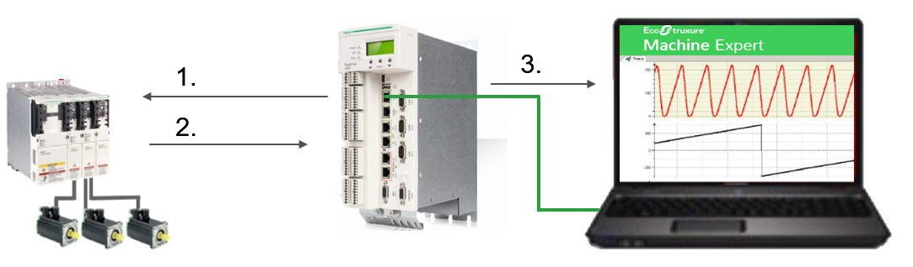

# General Information

## Library Overview

The FastSampling library provides objects for sampling data from Schneider Electric drive parameters with a higher resolution than provided by the Sercos cycle.

The figure illustrates the general data sampling process:

| Process step | Description |
| 1 | Fast sampling parameters are configured in the controller and the sampling process is started. |
| 2 | Configured parameter data is retrieved from the drive. |
| 3 | The controller is stopping the sampling process, saves the sampled data to an ARRAY and provides them to EcoStruxure Machine Expert. They can be displayed in a individual IEC trace graph dedicated to fast sampling results. |

## Data Sampling Methods

According to the performance provided by your system, retrieving sampled data from the drive can be performed in two different ways. A specific function block is provided for each sampling method:

| Data Sampling Method | Function Block | Description |
| --- | --- | --- |
| Asynchronous | [FB\_SamplingDataAsynchron](FB_SamplingDataAsynchron-62B104B6.html) | For systems providing restricted performance. Sampled data is buffered in the drive. |
| Real-time | [FB\_SamplingDataRealTime](FB_SamplingDataRealTime-62999CE1.html) | For high-performance systems. Sampled data is transferred in a continuous stream by the Sercos real-time channel. |

## Characteristics of the Library

The table indicates the characteristics of the library:

| Characteristic | Value |
| --- | --- |
| Library title | FastSampling |
| Company | Schneider Electric |
| Category | Application |
| Component | PacDrive |
| Default namespace | SE\_FS |
| Language model attribute | [Qualified-access-only](../../../../../api/crossBook?lang=en-US&virtualBookName=SoLibref&topicID=D_SE_0081219) |
| Forward compatible library | Yes [FCL](../../../../../api/crossBook?lang=en-US&virtualBookName=SoLibref&topicID=D_SE_0081226) |

NOTE: For this library, qualified-access-only is set. The POUs, data structures, enumerations, and constants have to be accessed using the namespace of the library. The default namespace of the library is SE\_FS.

## Controller and Drive Platforms

The FastSampling library is supported by the following platforms:

* PacDrive LMC Eco and PacDrive LMC Pro/Pro2 motion controllers
* Lexium 62 Advanced and Lexium 62 Standard drives

  with hardware revision RS10 and higher

## General Considerations

NOTE: Schneider Electric adheres to industry best practices in the development and implementation of control systems. This includes a "Defense-in-Depth" approach to secure an Industrial Control System. This approach places the controllers behind one or more firewalls to restrict access to authorized personnel and protocols only.

| WARNING | |
| --- | --- |
|  | UNAUTHENTICATED ACCESS AND SUBSEQUENT UNAUTHORIZED MACHINE OPERATION  * Evaluate whether your environment or your machines are connected to your critical infrastructure and, if so, take appropriate steps in terms of prevention, based on Defense-in-Depth, before connecting the automation system to any network. * Limit the number of devices connected to a network to the minimum necessary. * Isolate your industrial network from other networks inside your company. * Protect any network against unintended access by using firewalls, VPN, or other, proven security measures. * Monitor activities within your systems. * Prevent subject devices from direct access or direct link by unauthorized parties or unauthenticated actions. * Prepare a recovery plan including backup of your system and process information.  Failure to follow these instructions can result in death, serious injury, or equipment damage. |

For more information on organizational measures and rules covering access to infrastructures, refer to ISO/IEC 27000 series, Common Criteria for Information Technology Security Evaluation, ISO/IEC 15408, IEC 62351, ISA/IEC 62443, NIST Cybersecurity Framework, Information Security Forum - Standard of Good Practice for Information Security.

EIO0000004407.00

© 2021

Schneider Electric.

All rights reserved.