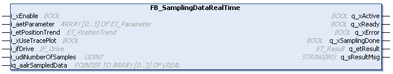
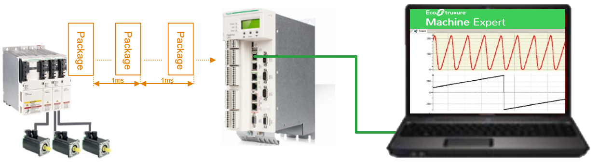

# FB\_SamplingDataRealTime

## Overview

|  |  |
| --- | --- |
| Type: | Function block |
| Available as of: | V1.0.0.0 |

## Functional Description

The function block FB\_SamplingDataRealTime retrieves data from the drive in real-time. It must be called in a cyclic task. A continuous stream of data packages is transferred in 1 ms intervals. It contains data in a 125 μs time grid.

The number of samples to be recorded is limited to 80,000. Thus, the maximum sampling time is 10 s. Consider that the recording of 80,000 samples requires an ARRAY which is capable to hold 320,000 values of type LREAL (ARRAY [1..80000] OF ARRAY [0..3] OF LREAL). For the memory size, refer to [Function Blocks Using Dynamic Memory Allocation](FunctionBlocksUsingDynamicMemoryAll-66C6D4B5.html).

After the function block is enabled and is ready for operation, the sampling process is started upon a rising edge at the xStartSampling property. The property can be located in a different task than the task where the function block is called.

To allow real-time sampling of data, perform the following settings in the configuration of the drive:

1. Double-click the drive node to open the drive editor.
2. Select the Sercos Cyclic Data Exchange tab.
3. Select the option Enable expert settings.
4. Click the plus sign (Add a parameter) from the Acknowledge Telegram (Slave -> Master) section on the right-hand side of the drive editor.

   **Result**: The Select parameters for cyclic exchange dialog box opens.
5. Select the FastSamplingChannels row and click OK.

   **Result**: A FastSamplingChannels row is added to the Acknowledge Telegram (Slave -> Master) section.

## Interface

| Input | Data type | Description |
| --- | --- | --- |
| i\_xEnable | BOOL | Activation and initialization of the function block.  Refer to [Behavior of Function Blocks with the Input i\_xEnable](BehaviorOfFunctionBlocksWithTheInpu-5EA5C09C.html). |
| i\_aetParameter | ARRAY [0...3] OF ET\_Parameter | Specify the parameters to be sampled. |
| i\_etPositionTrend | [ET\_PositionTrend](ET_PositionTrend-62280C88.html) | Specifies whether set positions of the axis are considered for sampling. |
| i\_udiNumberOfSamples | UDINT | Specifies the number of samples to be recorded.  Value range: 0...80,000  The samples are saved to an internal array in allocated memory. For further information, refer to [Function Blocks Using Dynamic Memory Allocation](FunctionBlocksUsingDynamicMemoryAll-66C6D4B5.html). |
| i\_xUseTracePlot | BOOL | If TRUE, the sampled data is plotted to an IEC trace graph, also refer to [Displaying Sampled Data in a Trace Plot](CallingFunctionBlocksAndStartTrigge-66B898FB.html#CallingFunctionBlocksAndStartTrigge-66B898FB__OpeningATracePlot-6D083FCD). |
| i\_ifDrive | SystemConfigurationItf.IF\_Drive | Specifies the axis from which data is sampled. |

| Input/Output | Data type | Description |
| --- | --- | --- |
| iq\_aalrSampledData | ARRAY [\*] OF ARRAY [0..3] OF LREAL | Array for storing the sampled data. The meaning and the order of the parameters per data record corresponds to the specified parameter at i\_aetParameter. This IN\_OUT parameter provides an array with variable length, the amount of data records you want to store must correspond to the size of the array assigned. |

| Output | Data type | Description |
| --- | --- | --- |
| q\_xActive | BOOL | If this output is set to TRUE, the function block is active. |
| q\_xReady | BOOL | If this output is set to TRUE, the activation was successful. |
| q\_xError | BOOL | If this output is set to TRUE, an error has been detected. For details, refer to q\_etResult and q\_sResultMsg. |
| q\_xSamplingDone | BOOL | If this output is set to TRUE, the sampling process is finished and the recorded data are provided in the array at iq\_aalrSampledData. |
| q\_etResult | ET\_Result | Provides diagnostic and status information as a numeric value. |
| q\_sResultMsg | STRING [80] | Provides additional diagnostic and status information as a text message. |

| Property | Data type | Access | Description |
| --- | --- | --- | --- |
| xStartSampling | BOOL | Read/write | Input that initiates the start of the sampling process.  The input can be called in a fast task. For further information, refer to [Behavior of the Property xStartSampling](CallingFunctionBlocksAndStartTrigge-66B898FB.html#CallingFunctionBlocksAndStartTrigge-66B898FB__section-122-66BC68FD). |

NOTE:

While the sampling process is in progress, an Online Change of the application cannot be performed. The sampling process is outsourced to a separate task. As long as this task is not completed, a requested online change is rejected. If this is the case, Logic Builder issues a message informing you that an online change cannot be performed.

EIO0000004407.00

© 2021

Schneider Electric.

All rights reserved.