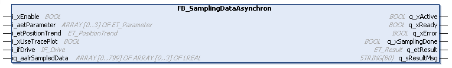
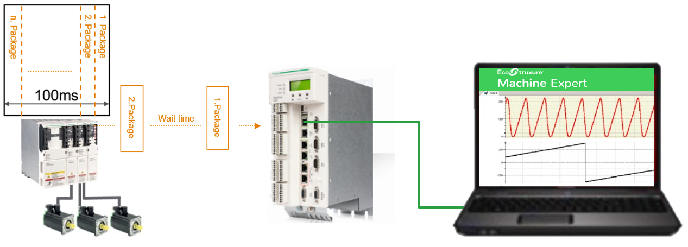

# FB\_SamplingDataAsynchron

## Overview

|  |  |
| --- | --- |
| Type: | Function block |
| Available as of: | V1.0.0.0 |

## Functional Description

The function block FB\_SamplingDataAsynchron retrieves data from the drive in asynchronous mode. It must be called in a cyclic task. The duration of the sampling process is fixed to 100 ms, accordingly it provides 800 data records. The sampled data are stored on the drive. When the sampling process is finished, the application is retrieving the single packages from the drive in a certain interval. After the packages have been retrieved, the function block indicates that the sampling process is done and provides the recorded data in the array at iq\_aalrSampledData.

The xStartSampling property is additionally provided to start the sampling process. For a quick start of the sampling process, it can be called in a fast task.

No additional configuration is necessary to use asynchronous sampling.

## Interface

| Input | Data type | Description |
| --- | --- | --- |
| i\_xEnable | BOOL | Activation and initialization of the function block.  Refer to [Behavior of Function Blocks with the Input i\_xEnable](BehaviorOfFunctionBlocksWithTheInpu-5EA5C09C.html). |
| i\_aetParameter | ARRAY [0...3] OF ET\_Parameter | Specify the parameters to be sampled. |
| i\_etPositionTrend | [ET\_PositionTrend](ET_PositionTrend-62280C88.html) | Specifies whether set positions of the axis are considered for sampling. |
| i\_xUseTracePlot | BOOL | If TRUE, the sampled data is plotted to an IEC trace graph, also refer to [Displaying Sampled Data in a Trace Plot](CallingFunctionBlocksAndStartTrigge-66B898FB.html#CallingFunctionBlocksAndStartTrigge-66B898FB__OpeningATracePlot-6D083FCD). |
| i\_ifDrive | SystemConfigurationItf.IF\_Drive | Specifies the axis from which data is sampled. |

| Input/Output | Data type | Description |
| --- | --- | --- |
| iq\_aalrSampledData | ARRAY [0...799] OF ARRAY [0...3] OF REAL | Array for storing the sampled data. The meaning and the order of the parameters per data record correspond to the specified parameter at i\_aetParameter. |

| Output | Data type | Description |
| --- | --- | --- |
| q\_xActive | BOOL | If this output is set to TRUE, the function block is active. |
| q\_xReady | BOOL | If this output is set to TRUE, the activation was successful. |
| q\_xError | BOOL | If this output is set to TRUE, an error has been detected. For details, refer to q\_etResult and q\_sResultMsg. |
| q\_xSamplingDone | BOOL | If this output is set to TRUE, the sampling process is finished and the recorded data are provided in the array at iq\_aalrSampledData. |
| q\_etResult | ET\_Result | Provides diagnostic and status information as a numeric value. |
| q\_sResultMsg | STRING [80] | Provides additional diagnostic and status information as a text message. |

| Property | Data type | Access | Description |
| --- | --- | --- | --- |
| xStartSampling | BOOL | Read/write | Input that initiates the start of the sampling process.  The input can be called in a fast task. For further information, refer to [Behavior of the Property xStartSampling](CallingFunctionBlocksAndStartTrigge-66B898FB.html#CallingFunctionBlocksAndStartTrigge-66B898FB__section-122-66BC68FD). |

NOTE:

While the sampling process is in progress, an Online Change of the application cannot be performed. The sampling process is outsourced to a separate task. As long as this task is not completed, a requested online change is rejected. If this is the case, Logic Builder issues a message informing you that an online change cannot be performed.

EIO0000004407.00

© 2021

Schneider Electric.

All rights reserved.