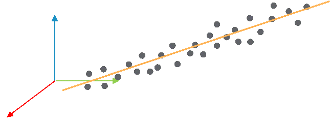

# FC\_Line3DBestFitFromPoints - General Information

## Overview

|  |  |
| --- | --- |
| Type: | Function |
| Available as of: | V1.0.0.0 |
| Versions: | Current version |

This chapter provides information on:

* [Description](#FC_Line3DBestFitFromPoints-GeneralI-983273B4__Description-9831EC8B)
* [Interface](#FC_Line3DBestFitFromPoints-GeneralI-983273B4__Interface-983207E7)
* [Return Value](#FC_Line3DBestFitFromPoints-GeneralI-983273B4__section-135-98320CC5)
* [Diagnostic Messages](#FC_Line3DBestFitFromPoints-GeneralI-983273B4__DiagnosticMessages-98321E06)

## Description

Given a list of 3D points, the function tries to fit the data with a 3D line.

## Interface

| Input | Data type | Description |
| --- | --- | --- |
| i\_astPoints | ARRAY [1...Gc\_udiMaxNumberOfPoints] OF SE\_MATH.ST\_Vector3D | List of 3D points to fit. |
| i\_udiNumberOfPoints | UDINT | Number of points to fit. |

| Output | Data type | Description |
| --- | --- | --- |
| q\_xError | BOOL | If this output is set to TRUE, an error has been detected. For details, refer to q\_etResult and q\_etResultMsg. |
| q\_etResult | [ET\_Result](ET_Result-GeneralInformation-93D70399.html#ET_Result-GeneralInformation-93D70399) | Provides diagnostic and status information.  If q\_xError = FALSE, then q\_etResult provides status information.  If q\_xError = TRUE, then q\_etResult provides diagnostic/error information.  The enumeration ET\_Result contains the possible values of the POU operation results. |
| q\_sResultMsg | STRING[80] | Provides additional information about the current status of the POU. |
| q\_stCenterPoint | SE\_MATH.ST\_Vector3D | Center point of the list, lying on the best-fit line. |
| q\_stDirection | SE\_MATH.ST\_Vector3D | Direction of the best-fit line. |

## Return Value

| Data type | Description |
| --- | --- |
| SE\_MATH.ST\_Line3D | The function returns a 3D line fitting the input points i\_astPoints. |

## Diagnostic Messages

| q\_xError | q\_etResult | Enumeration value | Description |
| --- | --- | --- | --- |
| FALSE | Ok | 0 | Success |
| TRUE | NumberOfPointsInvalid | 2 | An invalid number of points has been provided. |
| TRUE | PointsIdentical | 3 | Two points have the same coordinates. |

## NumberOfPointsInvalid

|  |  |
| --- | --- |
| Enumeration name: | NumberOfPointsInvalid |
| Enumeration value: | 2 |
| Description: | An invalid number of points has been provided. |

| Issue | Cause | Solution |
| --- | --- | --- |
| Evaluation of parameters for a new 3D line was not successful. | The parameter i\_udiNumberOfPoints is not within the range [2, Gc\_udiMaxNumberOfPoints] | Verify that 2 ≤i\_udiNumberOfPoints ≤ Gc\_udiMaxNumberOfPoints |

## Ok

|  |  |
| --- | --- |
| Enumeration name: | Ok |
| Enumeration value: | 0 |
| Description: | Success |

## PointsIdentical

|  |  |
| --- | --- |
| Enumeration name: | PointsIdentical |
| Enumeration value: | 3 |
| Description: | Two points have the same coordinates. |

| Issue | Cause | Solution |
| --- | --- | --- |
| Evaluation of parameters for a new 3D line was not successful. | All points inside the list i\_astPoints have the same coordinates. | Verify that at least one of the points listed inside i\_astPoints differs from the other points in the list. |

EIO0000004466.01