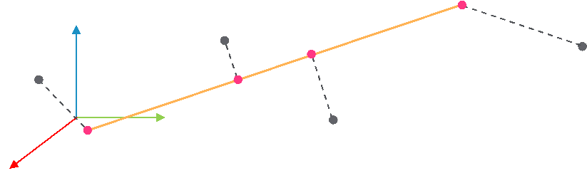

# FC\_ PointLine3DClosestPoint - General Information

## Overview

|  |  |
| --- | --- |
| Type: | Function |
| Available as of: | V1.0.0.0 |
| Versions: | Current version |

This chapter provides information on:

* [Description](#FC_PointLine3DClosestPoint-GeneralI-983A423F__section-133-983AC173)
* [Interface](#FC_PointLine3DClosestPoint-GeneralI-983A423F__section-134-983ACAE6)
* [Return Value](#FC_PointLine3DClosestPoint-GeneralI-983A423F__section-135-983AD716)
* [Diagnostic Messages](#FC_PointLine3DClosestPoint-GeneralI-983A423F__section-136-983ADF74)

## Description

The function evaluates the closest point between a 3D line and a 3D point, and it returns the coordinates of such point. The returned point is always on the line described by i\_stLine.

## Interface

| Input | Data type | Description |
| --- | --- | --- |
| i\_stPoint | SE\_MATH.ST\_Vector3D | A 3D point. |
| i\_stLine | SE\_MATH.ST\_Line3D | A 3D line on which the closest point is evaluated. |

| Output | Data type | Description |
| --- | --- | --- |
| q\_xError | BOOL | If this output is set to TRUE, an error has been detected. For details, refer to q\_etResult and q\_etResultMsg. |
| q\_etResult | [ET\_Result](ET_Result-GeneralInformation-93D70399.html#ET_Result-GeneralInformation-93D70399) | Provides diagnostic and status information.  If q\_xError = FALSE, then q\_etResult provides status information.  If q\_xError = TRUE, then q\_etResult provides diagnostic/error information.  The enumeration ET\_Result contains the possible values of the POU operation results. |
| q\_sResultMsg | STRING[80] | Provides additional information about the current status of the POU. |

## Return Value

| Data type | Description |
| --- | --- |
| SE\_MATH.ST\_Vector3D | The function evaluates the coordinates of the closest point between a 3D point and a 3D line. |

## Diagnostic Messages

| q\_xError | q\_etResult | Enumeration value | Description |
| --- | --- | --- | --- |
| FALSE | Ok | 0 | Success |
| TRUE | PointsIdentical | 3 | Two points have the same coordinates. |

## Ok

|  |  |
| --- | --- |
| Enumeration name: | Ok |
| Enumeration value: | 0 |
| Description: | Success |

## PointsIdentical

|  |  |
| --- | --- |
| Enumeration name: | PointsIdentical |
| Enumeration value: | 3 |
| Description: | Two points have the same coordinates. |

| Issue | Cause | Solution |
| --- | --- | --- |
| Evaluation of the project point was not successful. | i\_stLine.stPoint1 and i\_stLine.stPoint2 have the same coordinates. | Verify that i\_stLine.stPoint1 and i\_stLine.stPoint2 have different coordinates. |

EIO0000004466.01