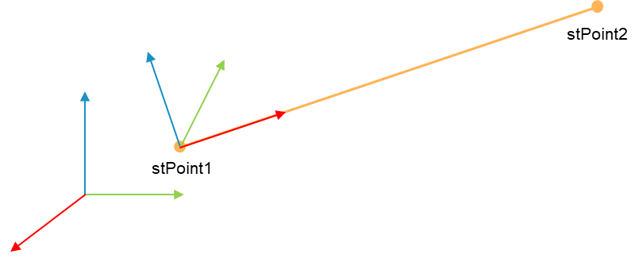

# FC\_Line3DToRotationMatrix - General Information

## Overview

|  |  |
| --- | --- |
| Type: | Function |
| Available as of: | V1.0.0.0 |
| Versions: | Current version |

This chapter provides information on:

* [Description](#FCLi3DToRotMat-984E3F77__Description-984D3AEB)
* [Interface](#FCLi3DToRotMat-984E3F77__Interface-984D459B)
* [Return Value](#FCLi3DToRotMat-984E3F77__ReturnValue-984D5063)
* [Diagnostic Messages](#FCLi3DToRotMat-984E3F77__DiagnosticMessages-984D5817)

## Description

Starting from the description of a line, the function defines an orientation considering the x axis pointing from i\_stLine stPoint1 to i\_stLine.stPoint2, the z axis points up (third component of the z versor with positive value) and the y axis accordingly to the right-hand rule. The rotation about the x axis is considered to be null.

The orientation is described as a 3D rotation matrix.

## Interface

| Input | Data type | Description |
| --- | --- | --- |
| i\_stLine | SE\_MATH.ST\_Line3D | Line to consider. |

| Output | Data type | Description |
| --- | --- | --- |
| q\_xError | BOOL | If this output is set to TRUE, an error has been detected. For details, refer to q\_etResult and q\_etResultMsg. |
| q\_etResult | [ET\_Result](ET_Result-GeneralInformation-93D70399.html#ET_Result-GeneralInformation-93D70399) | Provides diagnostic and status information.  If q\_xError = FALSE, then q\_etResult provides status information.  If q\_xError = TRUE, then q\_etResult provides diagnostic/error information.  The enumeration ET\_Result contains the possible values of the POU operation results. |
| q\_sResultMsg | STRING[80] | Provides additional information about the current status of the POU. |

## Return Value

| Data type | Description |
| --- | --- |
| SE\_MATH.ST\_Matrix3D | The functions returns an orientation described as a 3D rotation matrix. |

## Diagnostic Messages

| q\_xError | q\_etResult | Enumeration value | Description |
| --- | --- | --- | --- |
| FALSE | Ok | 0 | Success |
| TRUE | PointsIdentical | 3 | Two points have the same coordinates. |

## Ok

|  |  |
| --- | --- |
| Enumeration name: | Ok |
| Enumeration value: | 0 |
| Description: | Success |

## PointsIdentical

|  |  |
| --- | --- |
| Enumeration name: | PointsIdentical |
| Enumeration value: | 3 |
| Description: | Two points have the same coordinates. |

| Issue | Cause | Solution |
| --- | --- | --- |
| Evaluation of the rotation matrix was not successful. | i\_stLine.stPoint1 and i\_stLine.stPoint2 have the same coordinates. | Verify that i\_stLine.stPoint1 and i\_stLine.stPoint2 have different coordinates. |

EIO0000004466.01