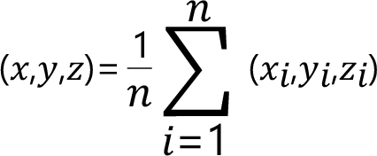

# FC\_AveragePointFromPoints - General Information

## Overview

|  |  |
| --- | --- |
| Type: | Function |
| Available as of: | V1.0.0.0 |
| Versions: | Current version |

This chapter provides information on:

* [Description](#FC_Avera-984F35D5__Description-984EE71F)
* [Interface](#FC_Avera-984F35D5__Interface-984EF406)
* [Return Value](#FC_Avera-984F35D5__ReturnValue-984EFDE8)
* [Diagnostic Messages](#FC_Avera-984F35D5__DiagnosticMessages-984F062A)

## Description

Evaluates the average point from a list of provided points. The function returns the Cartesian coordinates of this point.

## Interface

| Input | Data type | Description |
| --- | --- | --- |
| i\_astPoints | ARRAY [1...Gc\_udiMaxNumberOfPoints] OF SE\_MATH.ST\_Vector3D | List of points to consider. |
| i\_udiNumberOfPoints | UDINT | Number of provided points. |

| Output | Data type | Description |
| --- | --- | --- |
| q\_xError | BOOL | If this output is set to TRUE, an error has been detected. For details, refer to q\_etResult and q\_etResultMsg. |
| q\_etResult | [ET\_Result](ET_Result-GeneralInformation-93D70399.html#ET_Result-GeneralInformation-93D70399) | Provides diagnostic and status information.  If q\_xError = FALSE, then q\_etResult provides status information.  If q\_xError = TRUE, then q\_etResult provides diagnostic/error information.  The enumeration ET\_Result contains the possible values of the POU operation results. |
| q\_sResultMsg | STRING[80] | Provides additional information about the current status of the POU. |

## Return Value

| Data type | Description |
| --- | --- |
| SE\_MATH.ST\_Vector3D | The function returns the coordinates of the average point evaluated from the list of provided points. |

## Diagnostic Messages

| q\_xError | q\_etResult | Enumeration value | Description |
| --- | --- | --- | --- |
| FALSE | Ok | 0 | Successful |
| FALSE | OnlyOnePointProvided | 14 | A list of points containing a single point was provided. |
| TRUE | NumberOfPointsInvalid | 2 | An invalid number of points has been provided. |

## NumberOfPointsInvalid

|  |  |
| --- | --- |
| Enumeration name: | NumberOfPointsInvalid |
| Enumeration value: | 2 |
| Description: | An invalid number of points has been provided. |

| Issue | Cause | Solution |
| --- | --- | --- |
| Evaluation of the center point was not successful. | i\_udiNumberOfPoints is not within in the range [1, Gc\_udiMaxNumberOfPoints] | Verify that 1 ≤i\_udiNumberOfPoints ≤Gc\_udiMaxNumberOfPoints. |

## Ok

|  |  |
| --- | --- |
| Enumeration name: | Ok |
| Enumeration value: | 0 |
| Description: | Successful |

## OnlyOnePointProvided

|  |  |
| --- | --- |
| Enumeration name: | OnlyOnePointProvided |
| Enumeration value: | 14 |
| Description: | A list of points containing a single point was provided.  Success but since i\_udiNumberOfPoints = 1, the returned point is equal to the first point in the list. |

EIO0000004466.01