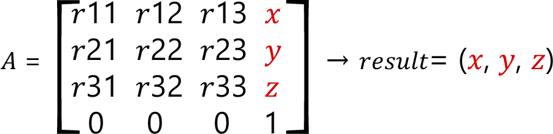

# FC\_PoseMatrixToPosition - General Information

## Overview

|  |  |
| --- | --- |
| Type: | Function |
| Available as of: | V1.0.0.0 |
| Versions: | Current version |

This chapter provides information on:

* [Description](#FC_Pose-A7B1A016__Description-A7B0E8BF)
* [Interface](#FC_Pose-A7B1A016__Interface-A7B0EB3D)
* [Return Value](#FC_Pose-A7B1A016__ReturnValue-A7B0ED03)
* [Diagnostic Messages](#FC_Pose-A7B1A016__DiagnosticMessages-A7B0EEF4)

## Description

Given a pose matrix, the function returns a 3D vector representing the translational part of the input pose.

## Interface

| Input | Data type | Description |
| --- | --- | --- |
| i\_stPoseMatrix | SE\_MATH.ST\_Matrix4D | A 4D matrix describing a Cartesian pose. |

| Output | Data type | Description |
| --- | --- | --- |
| q\_xError | BOOL | If this output is set to TRUE, an error has been detected. For details, refer to q\_etResult and q\_etResultMsg. |
| q\_etResult | [ET\_Result](ET_Result-GeneralInformation-93D70399.html#ET_Result-GeneralInformation-93D70399) | Provides diagnostic and status information.  If q\_xError = FALSE, then q\_etResult provides status information.  If q\_xError = TRUE, then q\_etResult provides diagnostic/error information.  The enumeration ET\_Result contains the possible values of the POU operation results. |
| q\_sResultMsg | STRING[80] | Provides additional information about the current status of the POU. |

## Return Value

| Data type | Description |
| --- | --- |
| SE\_MATH.ST\_Vector3D | The function returns a 3D vector representing the translational part of the input pose. |

## Diagnostic Messages

| q\_xError | q\_etResult | Enumeration value | Description |
| --- | --- | --- | --- |
| FALSE | Ok | 0 | Success |

## Ok

|  |  |
| --- | --- |
| Enumeration name: | Ok |
| Enumeration value: | 0 |
| Description: | Success |

EIO0000004466.01