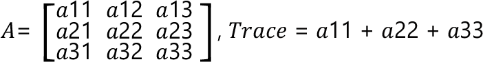

# FC\_Matrix3DTrace - General Information

## Overview

|  |  |
| --- | --- |
| Type: | Function |
| Available as of: | V1.0.0.0 |
| Versions: | Current version |

This chapter provides information on:

* [Description](FC_Matrix-9D64C857.html#FC_Matrix-9D64C857__Description-9D6443E2)
* [Interface](FC_Matrix-9D64C857.html#FC_Matrix-9D64C857__Interface-9D6446A1)
* [Return Value](FC_Matrix-9D64C857.html#FC_Matrix-9D64C857__ReturnValue-9D644FF1)
* [Diagnostic Messages](FC_Matrix-9D64C857.html#FC_Matrix-9D64C857__DiagnosticMessages-9D6451B9)

## Description

Given a 3D input matrix, the function returns the trace of such matrix. The trace of a squared matrix is defined as the sum of the elements on its main diagonal.

## Interface

| Input | Data type | Description |
| --- | --- | --- |
| i\_stMatrix | SE\_MATH.ST\_Matrix3D | A 3D matrix. |

| Output | Data type | Description |
| --- | --- | --- |
| q\_xError | BOOL | If this output is set to TRUE, an error has been detected. For details, refer to q\_etResult and q\_etResultMsg. |
| q\_etResult | [ET\_Result](ET_Result-GeneralInformation-93D70399.html#ET_Result-GeneralInformation-93D70399) | Provides diagnostic and status information.  If q\_xError = FALSE, then q\_etResult provides status information.  If q\_xError = TRUE, then q\_etResult provides diagnostic/error information.  The enumeration ET\_Result contains the possible values of the POU operation results. |
| q\_sResultMsg | STRING[80] | Provides additional information about the current status of the POU. |

## Return Value

| Data type | Description |
| --- | --- |
| LREAL | The function returns the trace of a 3D input matrix. |

## Diagnostic Messages

| q\_xError | q\_etResult | Enumeration value | Description |
| --- | --- | --- | --- |
| FALSE | Ok | 0 | Success |

## Ok

|  |  |
| --- | --- |
| Enumeration name: | Ok |
| Enumeration value: | 0 |
| Description: | Success |

EIO0000004466.01