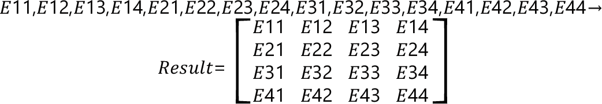

# FC\_Matrix4DSetElements - General Information

## Overview

|  |  |
| --- | --- |
| Type: | Function |
| Available as of: | V1.0.0.0 |
| Versions: | Current version |

This chapter provides information on:

* [Description](#FC_Matrix-9FF49932__Description-9FF300E8)
* [Interface](#FC_Matrix-9FF49932__Interface-9FF301E8)
* [Return Value](#FC_Matrix-9FF49932__ReturnValue-9FF30464)
* [Diagnostic Messages](#FC_Matrix-9FF49932__DiagnosticMessages-9FF306C6)

## Description

Given a set of input elements, the function returns a new 4D matrix that contains such elements.

## Interface

| Input | Data type | Description |
| --- | --- | --- |
| i\_lrE11 | LREAL | Element (1, 1) of the matrix. |
| i\_lrE12 | LREAL | Element (1, 2) of the matrix. |
| i\_lrE13 | LREAL | Element (1, 3) of the matrix. |
| i\_lrE14 | LREAL | Element (1, 4) of the matrix. |
| i\_lrE21 | LREAL | Element (2, 1) of the matrix. |
| i\_lrE22 | LREAL | Element (2, 2) of the matrix. |
| i\_lrE23 | LREAL | Element (2, 3) of the matrix. |
| i\_lrE24 | LREAL | Element (2, 4) of the matrix. |
| i\_lrE31 | LREAL | Element (3, 1) of the matrix. |
| i\_lrE32 | LREAL | Element (3, 2) of the matrix. |
| i\_lrE33 | LREAL | Element (3, 3) of the matrix. |
| i\_lrE34 | LREAL | Element (3, 4) of the matrix. |
| i\_lrE41 | LREAL | Element (4, 1) of the matrix. |
| i\_lrE42 | LREAL | Element (4, 2) of the matrix. |
| i\_lrE43 | LREAL | Element (4, 3) of the matrix. |
| i\_lrE44 | LREAL | Element (4, 4) of the matrix. |

| Output | Data type | Description |
| --- | --- | --- |
| q\_xError | BOOL | If this output is set to TRUE, an error has been detected. For details, refer to q\_etResult and q\_etResultMsg. |
| q\_etResult | [ET\_Result](ET_Result-GeneralInformation-93D70399.html#ET_Result-GeneralInformation-93D70399) | Provides diagnostic and status information.  If q\_xError = FALSE, then q\_etResult provides status information.  If q\_xError = TRUE, then q\_etResult provides diagnostic/error information.  The enumeration ET\_Result contains the possible values of the POU operation results. |
| q\_sResultMsg | STRING[80] | Provides additional information about the current status of the POU. |

## Return Value

| Data type | Description |
| --- | --- |
| SE\_MATH.ST\_Matrix4D | The function returns a new 4D matrix that contains the input elements. |

## Diagnostic Messages

| q\_xError | q\_etResult | Enumeration value | Description |
| --- | --- | --- | --- |
| FALSE | Ok | 0 | Success |

## Ok

|  |  |
| --- | --- |
| Enumeration name: | Ok |
| Enumeration value: | 0 |
| Description: | Success |

EIO0000004466.01