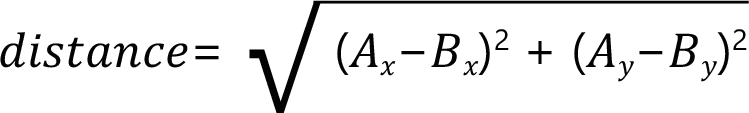

# FC\_Vector2DEuclideanDistance - General Information

## Overview

|  |  |
| --- | --- |
| Type: | Function |
| Available as of: | V1.0.0.0 |
| Versions: | Current version |

This chapter provides information on:

* [Description](#FC_Vector-A075979D__Description-A0752746)
* [Interface](#FC_Vector-A075979D__Interface-A0752899)
* [Return Value](#FC_Vector-A075979D__ReturnValue-A0752BDA)
* [Diagnostic Messages](#FC_Vector-A075979D__DiagnosticMessages-A0752D92)

## Description

Given two 2D input vectors, the function evaluates the Euclidean distance between the points described by such vectors.

## Interface

| Input | Data type | Description |
| --- | --- | --- |
| i\_stVectorA | SE\_MATH.ST\_Vector2D | A 2D vector. |
| i\_stVectorB | SE\_MATH.ST\_Vector2D | A 2D vector. |

| Output | Data type | Description |
| --- | --- | --- |
| q\_xError | BOOL | If this output is set to TRUE, an error has been detected. For details, refer to q\_etResult and q\_etResultMsg. |
| q\_etResult | [ET\_Result](ET_Result-GeneralInformation-93D70399.html#ET_Result-GeneralInformation-93D70399) | Provides diagnostic and status information.  If q\_xError = FALSE, then q\_etResult provides status information.  If q\_xError = TRUE, then q\_etResult provides diagnostic/error information.  The enumeration ET\_Result contains the possible values of the POU operation results. |
| q\_sResultMsg | STRING[80] | Provides additional information about the current status of the POU. |

## Return Value

| Data type | Description |
| --- | --- |
| LREAL | The function evaluates the Euclidean distance between the points described by two 2D input vectors. |

## Diagnostic Messages

| q\_xError | q\_etResult | Enumeration value | Description |
| --- | --- | --- | --- |
| FALSE | Ok | 0 | Success |

## Ok

|  |  |
| --- | --- |
| Enumeration name: | Ok |
| Enumeration value: | 0 |
| Description: | Success |

EIO0000004466.01