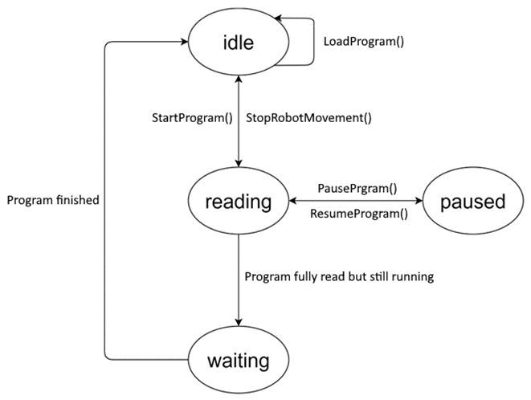

# ET\_ProgramState

## Overview

|  |  |
| --- | --- |
| Type: | Enumeration |
| Available as of: | V1.0.1.0 |

## Description

This enumeration type is used to address a specific program state of the Lexium Cobot.

## Enumeration Elements

| Name | Value | Description |
| --- | --- | --- |
| Idle | 0 | The program state of the Lexium Cobot is idle.  No program is loaded. |
| Reading | 1 | The program state of the Lexium Cobot is reading.  A program is loading. |
| Paused | 2 | The program state of the Lexium Cobot is paused.  The loaded program is paused. |
| Waiting | 3 | The program state of the Lexium Cobot is waiting.  The loaded program is fully read but still running. |

EIO0000005112.04