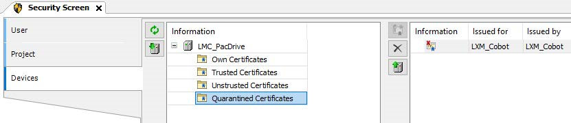

# Using Transport Layer Security (TLS) Certificate on TCP Connection with TLS

## Overview

When using the Lexium Cobot communication function blocks with TLS-Encryption, you must save the certificate manually to the trusted certificates.

At the first connection, the Lexium Cobot communication function block provides an exception.

This exception displays that the certificate is not being trusted. To set the certificate to trusted, you must verify and move (drag and drop) the certificate from Quarantined Certificates to Trusted Certificates in the [Security Screen](../../../../../api/crossBook?lang=en-US&virtualBookName=https://product-help.schneider-electric.com/Machine%20Expert/V2.1/en/SoMMenu&topicID=D_SE_0099371) editor in EcoStruxure Machine Expert Logic Builder.

After these settings, you must restart the Lexium Cobot function block to establish a new connection to the Lexium Cobot controller. The connection must be established without an exception.

EIO0000005112.04