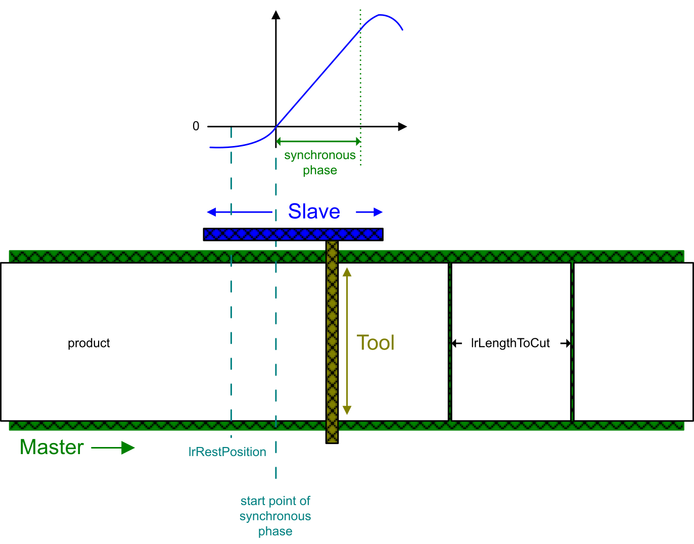

# Operating Mode Continuous

## Overview

The operating mode Continuous is used to process products with a constant length. This product length corresponds to the length of one process cycle and is defined via the input [i\_lrLengthToCut](InputPinFlyingShear-434DD0C0.html#InputPinFlyingShear-434DD0C0__InputPinDescription-434E1EC0).

Since the inputs of the function block are refreshed cyclically, the length can be modified during the running application.

NOTE: To help ensure that a change of the product length is considered for the next product cycle, modify the length to cut during the synchronous phase of the process cycle. Although it is possible to change length to cut outside of the synchronous phase, it may be that the modification would not be activated in next product cycle, but in the cycle thereafter.

The modified length is verified with each process cycle:

| If the value is ... | Then... |
| --- | --- |
| valid: >= q\_lrLengthToCutMin | The next product is processed with the new value of i\_lrLengthToCut. |
| invalid: <lrMinLengthToCutMin | * An error is detected. * The slave stops with the ramp [lrStopDeceleration](ST_Parameters-413D06E6.html#ST_Parameters-413D06E6__StructureElements-413D35BE). |

EIO0000004585.05