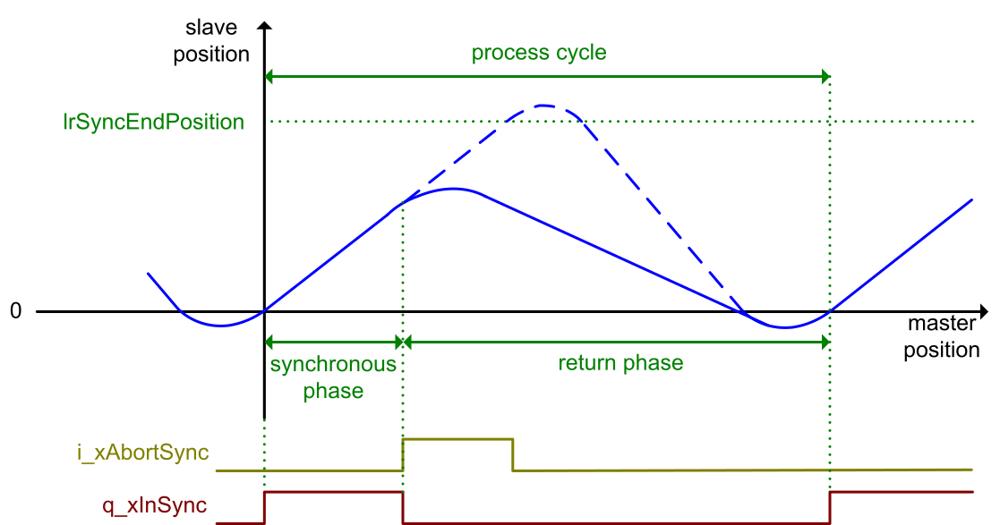

# Interruption of the Synchronous Phase

## Overview

As a prerequisite for this function, the process must be in the synchronous phase.

A rising edge at the input [i\_xAbortSync](InputPinFlyingShear-434DD0C0.html#InputPinFlyingShear-434DD0C0__InputPinDescription-434E1EC0) aborts the synchronous phase: The slave returns to the rest position or continues with the next process cycle without modifying the length of the process cycle.

EIO0000004585.05