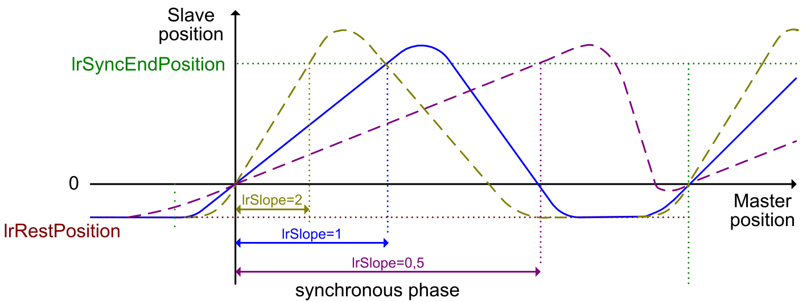

# Slope of the Synchronous Phase

## Overview

As a prerequisite for modifying the slope of the synchronous phase, the function block must be inactive.

Use the parameter [lrSlope](ST_Parameters-413D06E6.html#ST_Parameters-413D06E6__StructureElements-413D35BE) to introduce a slope coefficient for the synchronous phase:

* lrSlope = 1: The master and the slave axis are moving with the same velocity.
* lrSlope > 1: The slave is moving slower than the master.
* lrSlope < 1: The slave is moving faster than the master.

EIO0000004585.05