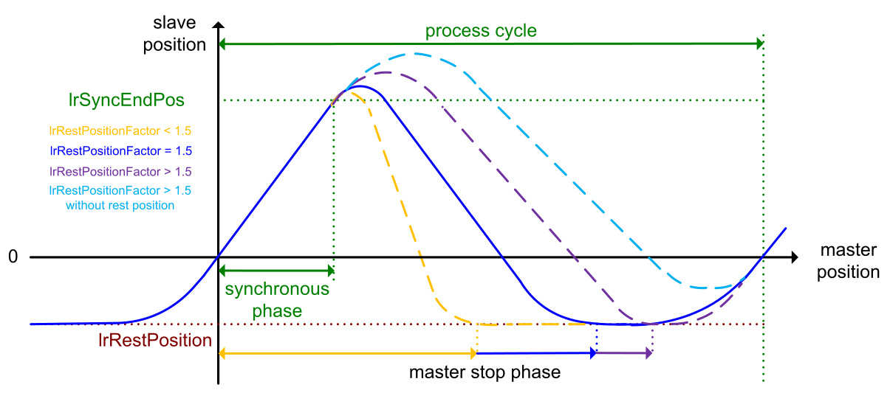

# Rest Position Factor

## Overview

The parameter lrRestPositionFactor allows you to modify the distance between the synchronous start position and the point when the slave axis reaches the rest position (master stop phase).

* The smaller the value, the sooner the slave axis reaches the rest position. This short master stop phase can lead to errors detected in the slave axis (following errors that are originally generated by the drive).
* The higher the value, the later the slave axis reaches the rest position. This long master stop phase leads to a smoother movement and can result in a [profile without rest position](FB_FlyingShear-4333C732.html#FB_FlyingShear-4333C732__ProfileOfMasterSlavePositionsWithou-434BD1FC).

For calculating the master stop phase, refer to the [Calculations](Calculations-5B62847A.html).

EIO0000004585.05