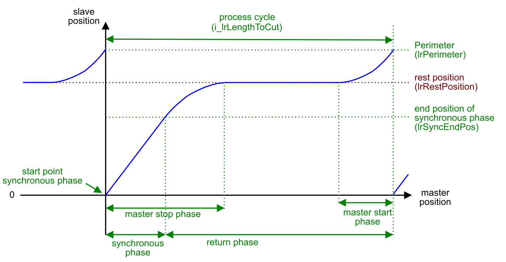
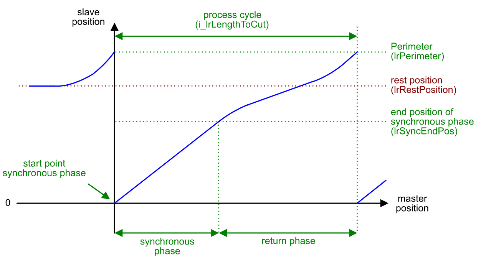
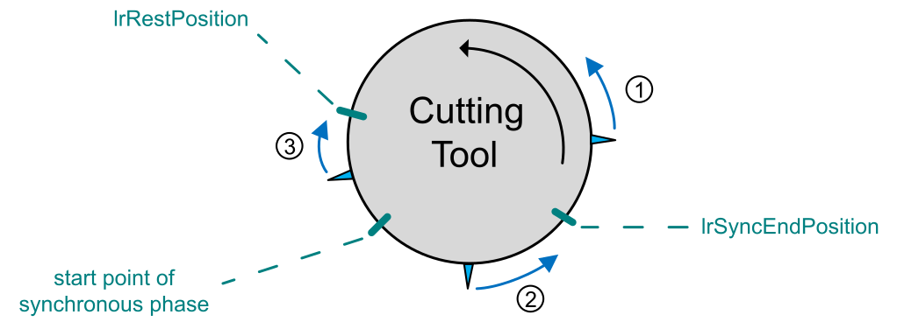

# RotaryKnife

## Phases of the Rotary Knife Process

A rotary knife cycle consists of 3 phases:

| Phase | Description |
| --- | --- |
| Start phase | The slave axis accelerates up to the velocity of the master axis (depending on the value of the parameter lrSlope) to be synchronized at the beginning of the synchronous phase.  The movement from the rest position to the start point of the synchronous phase is calculated as follows (in units defined for the master axis):    The parameter [lrRestPosition](ST_Parameters-413D06E6.html#ST_Parameters-413D06E6__StructureElements-413D35BE) must have a value > lrSyncEndPosition < lrPerimeter. |
| Synchronous phase | The slave axis is synchronized with the master axis and the operation on the product is performed.  The synchronous phase starts at master position 0 and slave position 0.  A new process cycle is started with the start point of the synchronous phase. |
| Return phase | The slave axis is decoupled from the master axis and can continue operation in two different ways.   * It returns to the [rest position](#RotaryKnife-E476ECBC__RestPositionProfileOfMasterSlavePos-E47736D9). * It continues with the next process cycle [without reaching the rest position](#RotaryKnife-E476ECBC__ProfileOfMasterSlavePositionsWithou-E47739A2). |

During the rotary knife process, the slave axis can return to the rest position or short process cycles can be performed without returning to the rest position as described in the following sections.

## Profile of Master/Slave Positions with Rest Position

In general, the process is such that the slave axis returns to the rest position according to the following procedure:

1. The slave axis starts in the rest position.
2. The slave axis accelerates to the velocity of the master axis.
3. The slave axis follows the master synchronously during the working process (synchronous phase).
4. The slave axis returns to the rest position.

The curve illustrates the position profile of the slave axis in relation to the master axis with return to the rest position.

## Profile of Master/Slave Positions without Rest Position

The curve illustrates the position profile of the slave axis in relation to the master axis for short process cycles without returning to the rest position. The position profile of the slave is changed to short process cycles if the product length is shorter than i\_lrLengthToCut < lrMasterStartPhase + lrMasterStopPhase + 1.0.

NOTE: The total working area (including overshoot after synchronous phase) of the RotaryKnife axis depends on its parameterization, for example, lrRestPosition, lrSyncEndPosition and lrLengthToCut. In order to help avoid mechanical damage by exceeding a defined limited working area, it is a good practice to limit movement by incorporating limit switches in your design to stop the axis if need be.

## Movement to Rest Position

The slave axis moves to the rest position if one of the following situation applies:

* A cold start is executed.
* The warm start mode MoveToRestPosition is executed.
* The operation is stopped (i\_xStartOperation = FALSE) when the slave axis is outside the synchronous phase.

As the slave axis must not move through the synchronous area, there are two different ways to reach the rest position depending on the position of slave axis:

* If the slave axis is after the end position of the synchronous phase (lrSyncEndPos), it moves in forward direction to reach the rest position.
* If the slave axis is before the start point of the synchronous phase (within the master start phase), it moves in backward direction to reach the rest position.

  NOTE: Backward movement of the rotary knife axis is only and exclusively allowed in this case.

**1** After synchronous phase and before rest position: **forward** movement to rest position

**2** Inside synchronous phase: **forward** movement to rest position

**3** After rest position and before synchronous phase: **backward** movement to rest position

EIO0000004585.05