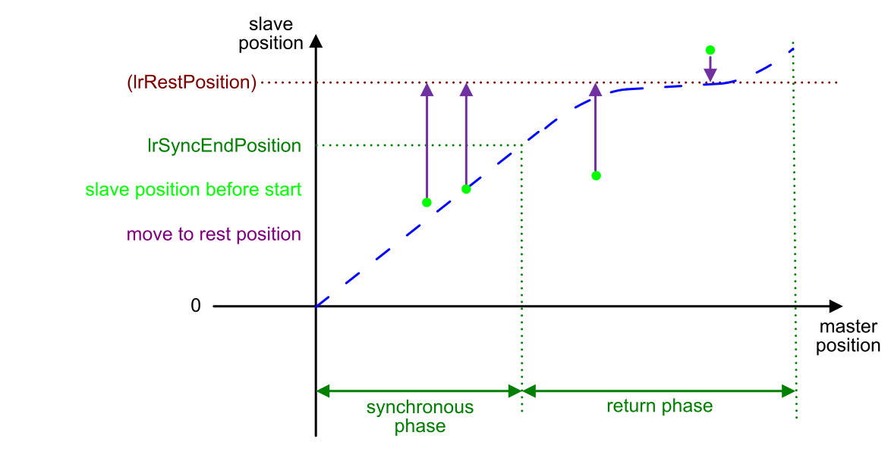
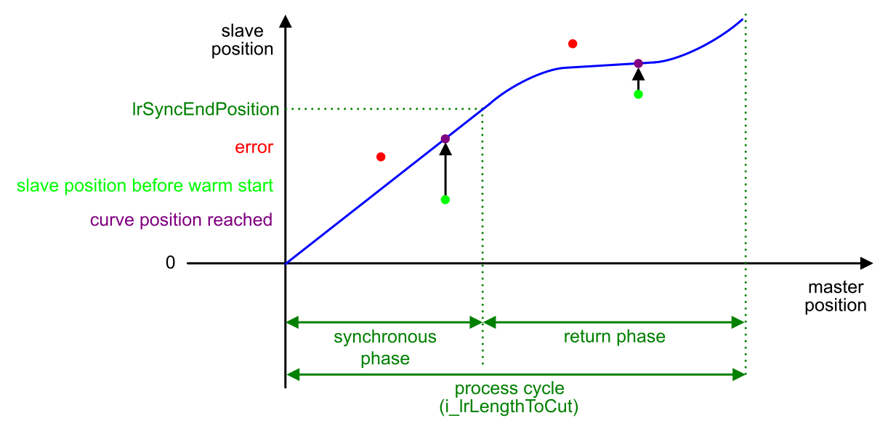
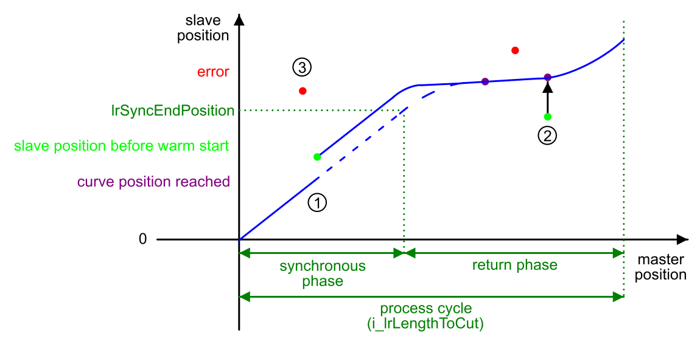

# Warm Start

## Overview

A warm start is the starting method used for a re-start of the function block following a temporary interruption (upon a falling edge on i\_xStartOperation), an error-stop or an emergency stop without de-activation of the application function block. The warm start mode according to the input i\_etStartMode is applied.

The previous context is preserved (touch probe positions captured inside the buffer) and considered for the restart of the movement. Thus, in operating modes ContinuousWithCorrection and CutOnTouchProbe the application can resume using valid positions from the buffer.

## Warm Start Modes

Three warm start modes are available depending on the application requirements. In all modes, the master position defines, if the curve position is inside or outside the synchronous phase. For each warm start mode, certain conditions must be fulfilled. The warm start mode is selected with the input [i\_etStartMode](InputPinFlyingShear-434DD0C0.html).

| Warm start modes | Description |
| --- | --- |
| MoveToRestPosition | The MoveToRestPosition mode is the only warm start that can be applied to a moving master axis.  The MoveToRestPosition mode can be used if the warm start modes MoveToCurvePosition and ContinueWithOffsetCurve are not applicable. As initial step, the slave axis is moved to the rest position. |
| MoveToCurvePosition  ContinueWithOffsetCurve | These warm start modes can only be executed if the master axis is not moving. Otherwise an error message is created.  These warm start modes are mainly used when there is a mechanical constraint between master axis and slave axis during the synchronization phase (such as a blade cutting into a metal sheet). In case of unintentional de-coupling of the master axis from the slave axis during the synchronization phase (for example, emergency stop), the slave axis can be re-coupled with the master axis according to different conditions. |

## Warm Start Mode MoveToRestPosition

The MoveToRestPosition mode is the only warm start mode that can be applied to a moving master axis.

Upon a rising edge at the input i\_xStartOperation, the following process is initiated:

1. The slave axis is moved to the rest position. The output q\_xStartPosReached indicates that the warm start position has been reached. Thus, the master axis can start the movement.
2. The slave axis is coupled to the master axis.
3. The next process cycle starts, depending on the operating mode.

## Warm Start Mode MoveToCurvePosition

With the MoveToCurvePosition warm start mode, the slave axis returns to the position on the loaded curve corresponding to the position of the master axis exclusively in forward direction. If the position of the slave axis is greater than the position on the curve, the error SlaveWarmStartPositionInvalid is created.

The master axis must remain in the PLCopen state standstill until the slave axis has reached the position on the curve. If the master axis is moving or started before the slave axis has reached the position on the curve, the error MasterAxisIsNotStandstill is created.

Upon a rising edge at the input i\_xStartOperation, the following process is initiated:

1. The slave axis returns to the position on the curve.
2. The interrupted process cycle is continued as soon as the master axis has been restarted.

The output q\_xStartPosReached indicates that the slave axis has reached the position on the curve and the master axis can start the movement. If the slave axis leaves this position, the output q\_xStartPosReached is set to FALSE.

## Warm Start Mode ContinueWithOffsetCurve

The slave axis continues with an offset or returns to the position on the loaded curve depending on the position of the master axis. To continue with an offset curve, the slave axis must be within the synchronous phase (see scenario 1 below).

The master axis must remain in the PLCopen state standstill until the slave axis has reached the position on the curve. If the master axis is moving or started before the slave axis has reached the position on the curve, the error MasterAxisIsNotStandstill is created.

The process is different, depending on whether the master axis is inside the synchronous phase.

**Scenario 1: The master and slave axis are inside the synchronous phase:**

Upon a rising edge at the input i\_xStartOperation, the following process is initiated:

1. The output q\_xStartPosReached is set to TRUE.
2. The slave axis remains in the position offset to the curve during the synchronous phase.
3. After the synchronous phase, the slave axis returns back to the position on the curve.
4. The interrupted process cycle is continued as soon as the master axis is restarted.

NOTE: The total working area (including overshoot after synchronous phase) of the axis depends on its parameterization. In order to help avoid mechanical damage by exceeding a defined limited working area, it is a good practice to limit movement by incorporating limit switches in your design to stop the axis if need be.

**Scenario 2: The master and slave axis are outside the synchronous phase:**

Upon a rising edge at the input i\_xStartOperation, the following process is initiated:

1. The slave axis returns to the position on the curve exclusively in forward direction. If the position of the slave axis is greater then the position on the curve, an error message is created.

   The output q\_xStartPosReached indicates that the slave axis has reached the position on the curve and the master axis can start the movement. If the slave axis leaves this position, the output q\_xStartPosReached is set to FALSE.
2. The interrupted process cycle is continued as soon as the master axis is restarted.

**Scenario 3: The master axis is inside and the slave axis is outside the synchronous phase:**

If the slave axis is outside the synchronous phase, the error message SlaveWarmStartPositionInvalid  is created. In this case, execute the warm start mode MoveToCurvePosition or a cold start.

EIO0000004585.05