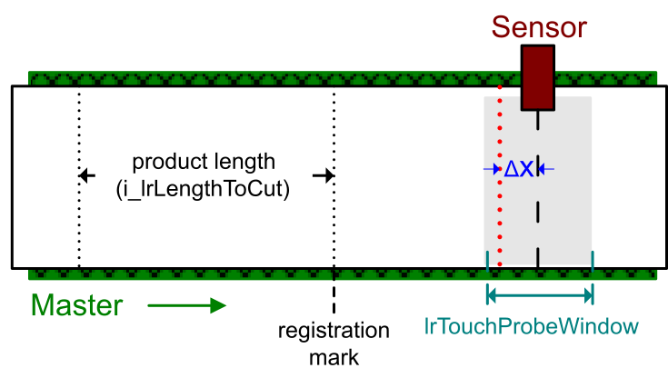
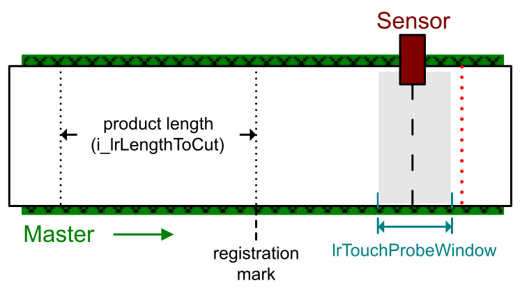
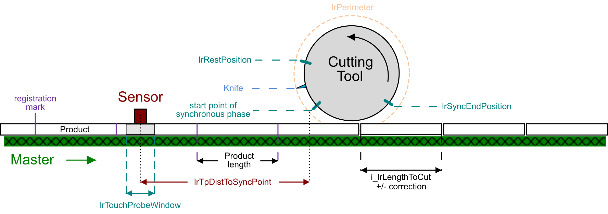

# Operating Mode ContinuousWithCorrection

## Overview

The operating mode ContinuousWithCorrection provides the same functionality as the operating mode Continuous, plus an automatic correction of the product length, calculated from a position capture.

The product length correction is designed for applications processing products with small differences in length or products not rigid and strechable (for example, plastic film). To manage different product lengths, a sensor is placed on the master axis to capture the position of registration marks on the product. In combination with a touch probe function, the registration marks define the distances between the products.

For further information, refer to [Touch Probe Function to Capture the Position of the Master Axis](OpMSpecFunctions-44BBF56C.html#OpMSpecFunctions-44BBF56C__TouchProbeFunction-45DE6C49).

## Touch Probe Acceptance Window: lrTouchProbeWindow

The touch probe acceptance window allows you to limit the product length allowed. The length of the product must be within the touch probe acceptance window that corresponds to the parameter [lrTouchProbeWindow](ST_Parameters-413D06E6.html#ST_Parameters-413D06E6__StructureElements-413D35BE). It defines a range (that equals to half of the lrTouchProbeWindow before and half of the lrTouchProbeWindow after the sensor) in which detected touch probe signals are valid. The minimum value of this parameter is 0 and the maximum value is i\_lrLengthToCut .

NOTE: Do not modify the value of the parameter lrTouchProbeWindow while the function block is active. Modifications of ST\_Parameters values during operation are ignored and the function block continues to use the value from the last activation.

**Scenario 1: A touch probe signal is detected inside the touch probe acceptance window:**

If a touch probe signal is valid (a registration mark has been detected inside the lrTouchProbeWindow range), the length of the product is corrected from the expected length (i\_lrLengthToCut ) to the detected length, i.e. the distance between the two registration marks. For further information on calculating the minimum value for the length to cut, refer to [Minimum Value for Length to Cut (q\_lrLengthToCutMin)](Calculations-5B62847A.html#Calculations-5B62847A__MinimumValueForLengthToCutq_lrLengt-5B669A00).

Registration marks detected outside the lrTouchProbeWindow are ignored.

**Scenario 2: NO touch probe signal is detected inside the touch probe acceptance window:**

If no registration mark is detected within the window:

* The length of the product is set to the value of i\_lrLengthToCut.
* The output q\_xTpOutsideWindow is set to TRUE to indicate that no registration mark has been detected inside the touch probe acceptance window.
* The output is reset to FALSE after the next call of the function block.

Upon a rising edge of the input [i\_xUseNextTp](InputPinFlyingShear-434DD0C0.html#InputPinFlyingShear-434DD0C0__InputPinDescription-434E1EC0), the next touch probe signal becomes valid without considering the lrTouchProbeWindow range.

## lrTpDistToSyncPoint for Calculation and Validation

For the calculation of the curves and the validation of the touch probe signals, the parameter [lrTpDistToSyncPoint](ST_Parameters-413D06E6.html#ST_Parameters-413D06E6__StructureElements-413D35BE) is required. This parameter defines the distance between the center point of the sensor and the start point of the synchronous phase.

EIO0000004585.05