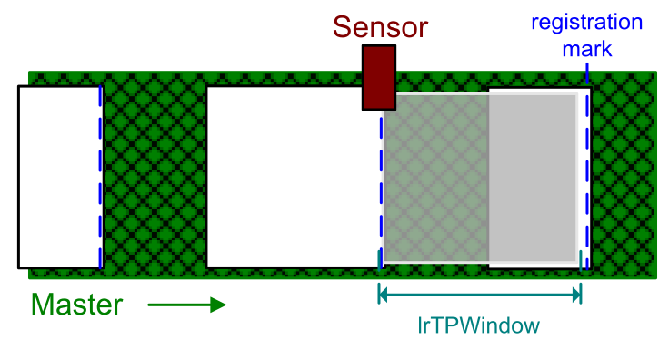
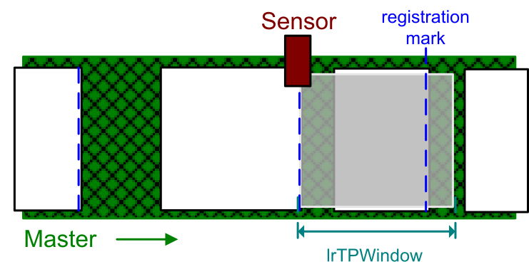
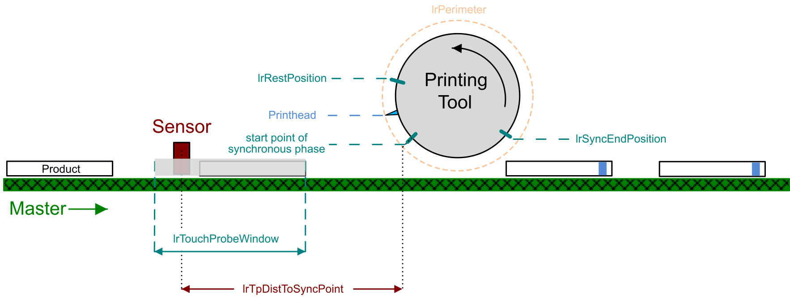

# Operating Mode CutOnTouchProbe

## Overview

The operating mode CutOnTouchProbe is used for processing products with variable length and format calculated from a position capture. The length of the process cycle is defined via registration marks corresponding to the distances between the products. These distances are calculated by the touch probe positions in connection with a touch probe ignorance window.

## Touch Probe Ignorance Window: lrTouchProbeWindow

The touch probe ignorance window corresponds to the parameter [lrTouchProbeWindow](ST_Parameters-413D06E6.html#ST_Parameters-413D06E6__StructureElements-413D35BE). It defines a range after the sensor in which detected touch probe signals are ignored as long as the registration mark of the previous touch probe signal is inside this window.

A new touch probe signal is only valid if the touch probe position is greater than the last touch probe position plus the value of the parameter lrTouchProbeWindow:

*touch probe position > last touch probe position + touch probe window*

The minimum value of the parameter lrTouchProbeWindow is calculated depending on the parameters of the function block configuration:

*master start phase + synchronous end position*

For further information on calculating the master start phase, refer to [Master Start Phase](Calculations-5B62847A.html#Calculations-5B62847A__MasterStartPhase-5B62BF7A).

NOTE: Do not modify the value of the parameter lrTouchProbeWindow while the function block is active. Modifications of ST\_Parameters values during operation are ignored and the function block continues to use the value from the last activation.

**Scenario 1: The touch probe signal is valid:**

*new touch probe position - last touch probe position = outside the touch probe window*

**Scenario 2: The touch probe signal is invalid:**

*new touch probe position - last touch probe position = inside the touch probe window*

## lrTpDistToSyncPoint for Calculation and Validation

For the calculation of the curves and the validation of the touch probe signals, the parameter [lrTpDistToSyncPoint](ST_Parameters-413D06E6.html#ST_Parameters-413D06E6__StructureElements-413D35BE) is required. This parameter defines the distance between the center point of the sensor and the start point of the synchronous phase.

EIO0000004585.05