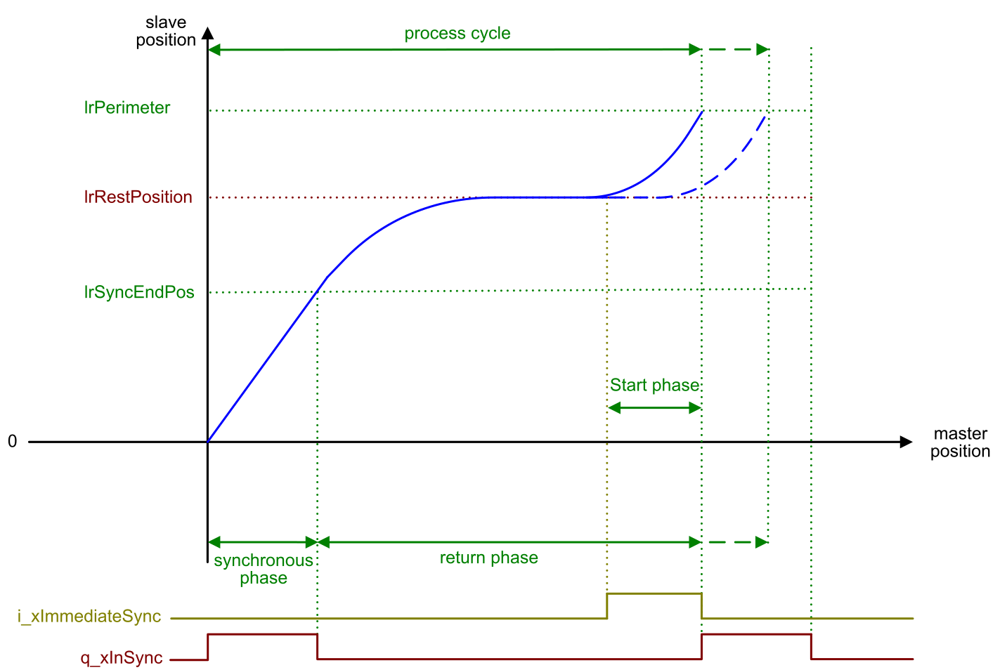

# Immediate Synchronization

## Overview

Prerequisites for this function:

* The slave is in rest position.
* The operating mode is Continuous.

A rising edge of the input [i\_xImmediateSync](InputPinFlyingShear-434DD0C0.html#InputPinFlyingShear-434DD0C0__InputPinDescription-434E1EC0) starts a new process cycle by initiating the synchronization of the slave to the master.

After the lrMasterStartPhase, the synchronous phase starts and the input i\_lrLengthToCut  is used for the length of the process cycle.

A rising edge of the input i\_xImmediateSync is ignored when the slave is not in lrRestPosition.

EIO0000004585.05